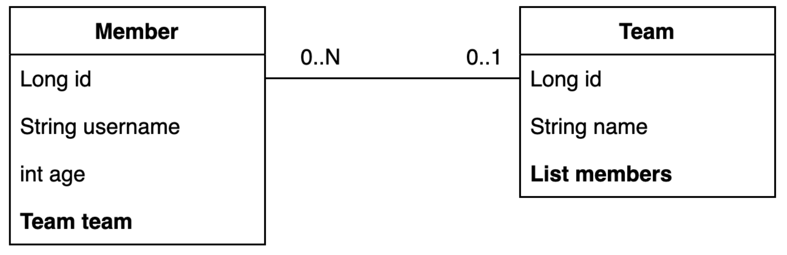
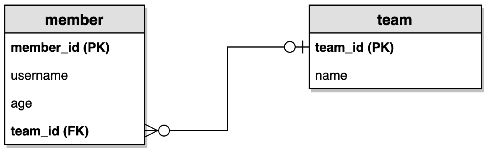

### 예제 도메인 모델과 동작 확인

스프링 데이터 JPA도 결국 도메인 모델에 대해서 동작한다.  
따라서 도메인 모델을 먼저 설계해야 한다.  
다음과 같이 간단한 엔티티 모델을 정의한다.



Member와 Team은 서로 다대일 관계이다.  
이를 바탕으로 테이블은 다음과 같이 정의할 수 있다. (ERD)



Member에서 Team에 대한 외래키를 가지고 있다.

#### 엔티티 클래스 정의

이제 각각의 엔티티 객체를 정의해보자.

먼저 Member 엔티티 객체는 다음과 같이 정의할 수 있다.  
엔티티의 경우 기본 생성자가 protected 이상의 접근 제어자를 가지도록 정의되어야 하므로, lombok을 통해 설정해준다.  
또한 편의를 위해 id, username, age를 출력해주는 toString을 정의한다.  
추후에 발생할 수 있는 무한 참조를 방지하기 위해 연관 객체인 team은 toString에서 제외해야 한다.

```java
package study.datajpa.entity;

@Entity
@Getter @Setter
@NoArgsConstructor(access = AccessLevel.PROTECTED)
@ToString(of = {"id", "username", "age"})
public class Member {
    @Id @GeneratedValue
    @Column(name = "member_id")
    private Long id;
    private String username;
    private int age;

    @ManyToOne(fetch = FetchType.LAZY)
    @JoinColumn(name = "team_id")
    private Team team;

    public Member(String username) {
        this(username, 0);
    }

    public Member(String username, int age) {
        this(username, age, null);
    }

    public Member(String username, int age, Team team) {
        this.username = username;
        this.age = age;
        if (team != null) {
            changeTeam(team);
        }
    }

    public void changeTeam(Team team) {
        this.team = team;
        team.getMembers().add(this);
    }
}
```

실무에서 가능하면 @Setter는 사용하지 않는 것이 좋다.  
위 예시에서는 team을 변경하는 연관관계 메서드인 changeTeam 메서드를 정의하여 사용하도록 하였다.  
이 때 changeTeam은 양 쪽의 연관관계를 모두 세팅해준다.

이제 Team 엔티티는 다음과 같이 정의한다.  
Member와 Team은 서로 양방향 연관관계를 가지고, Member가 연관관계의 주인이 된다.

```java
package study.datajpa.entity;

@Entity
@Getter @Setter
@NoArgsConstructor(access = AccessLevel.PROTECTED)
@ToString(of = {"id", "name"})
public class Team {
    @Id @GeneratedValue
    @Column(name = "team_id")
    private Long id;
    private String name;

    @OneToMany(mappedBy = "team")
    private List<Member> members = new ArrayList<>();

    public Team(String name) {
        this.name = name;
    }
}
```

이제 해당 엔티티를 테스트하기 위해 테스트 코드를 작성한다.

```java
package study.datajpa.entity;
@SpringBootTest
public class MemberTest {

    @PersistenceContext
    EntityManager em;

    @Test
    @Transactional
    @Rollback(false)
    public void testEntity() {
        Team teamA = new Team("teamA");
        Team teamB = new Team("teamB");
        em.persist(teamA);
        em.persist(teamB);

        Member member1 = new Member("member1", 10, teamA);
        Member member2 = new Member("member2", 20, teamA);
        Member member3 = new Member("member3", 30, teamB);
        Member member4 = new Member("member4", 40, teamB);

        em.persist(member1);
        em.persist(member2);
        em.persist(member3);
        em.persist(member4);

        // 초기화
        em.flush();
        em.clear();

        // 확인
        List<Member> members = em.createQuery("select m from Member m",
Member.class)
            .getResultList();
        for (Member member : members) {
            System.out.println("member=" + member);
            System.out.println("-> member.team=" + member.getTeam());
        }
    }
}
```

먼저 테스트를 위한 데이터(Team 2개, Member 4개)를 저장하고, 영속성 컨텍스트를 flush 및 clear 해서 초기화한다.  
그 후에 Member를 조회하면서 연관관계인 Team을 출력해보면 다음과 같이 출력된다.

```
member = Member(id=3, username=membi01, age=10)
-> member.team = Team(id=1, name=teamA)
member = Member(id=4, username=member2, age=20)
-> member.team = Team(id=1, name=teamA)
member = Member(id=5, username=member3, age=30)
-> member.team = Team(id=2, name=teamB)
member = Member(id=6, username=member4, age=40)
-> member.team = Team(id=2, name=teamB)
```

Member를 조회한 후 Team들이 정상적으로 지연로딩 되어 출력되는 것을 확인할 수 있다.
