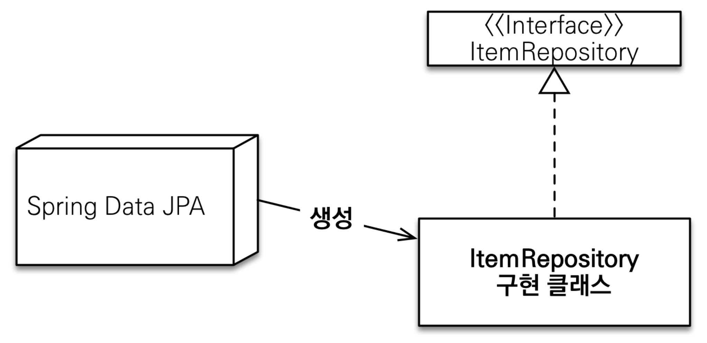
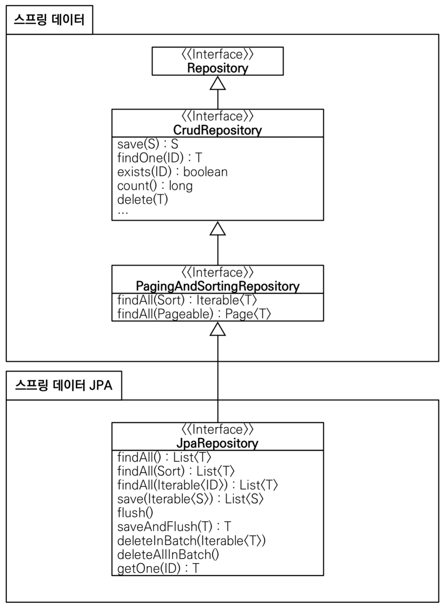

### 순수 JPA 기반 리포지토리 만들기

먼저 순수 JPA 기반으로 레포지토리를 구성해 본 뒤, 이를 스프링 데이터 JPA를 이용하여 바꾸는 식으로 진행할 것이다.  
스프링 데이터 JPA는 결국 JPA를 더 편리하게 사용하도록 지원해주는 툴이기 때문에, 기반이 되는 JPA 지식을 알아야 한다.

먼저 이전에 작성한 MemberJpaRepository 기반으로 기능을 추가하는 식으로 구현해보자.  
@PersistenceContext 어노테이션을 이용하면 entityManager를 주입받을 수 있다.  
기본 저장, 삭제, 단건 조회는 entityManager의 메서드를 이용해서 구현할 수 있다.  
목록 조회, count 조회는 jpql을 통해 조회해야 한다.  

```java
package study.datajpa.repository;

@Repository
public class MemberJpaRepository {

    @PersistenceContext
    private EntityManager em;

    public Member save(Member member) {
        em.persist(member);
        return member;
    }

    public void delete(Member member) {
        em.remove(member);
    }

    public List<Member> findAll() {
        return em.createQuery("select m from Member m", Member.class)
                .getResultList();
    }

    public Optional<Member> findById(Long id) {
        Member member = em.find(Member.class, id);
        return Optional.ofNullable(member);
    }

    public long count() {
        return em.createQuery("select count(m) from Member m", Long.class)
                .getSingleResult();
    }

    public Member find(Long id) {
         return em.find(Member.class, id);
    }
}
```

이제 Team에 대한 TeamJpaRepository를 구현해보자.  
MemberJpaRepository 에서 구현했던 것과 거의 유사한 코드로 구성된다.

```java
package study.datajpa.repository;

@Repository
public class TeamJpaRepository {

    @PersistenceContext
    private EntityManager em;

    public Team save(Team team) {
        em.persist(team);
        return team;
    }

    public void delete(Team team) {
        em.remove(team);
    }

    public List<Team> findAll() {
        return em.createQuery("select t from Team t", Team.class)
                .getResultList();
    }

    public Optional<Team> findById(Long id) {
        Team team = em.find(Team.class, id);
        return Optional.ofNullable(team);
    }

    public long count() {
        return em.createQuery("select count(t) from Team t", Long.class)
    }
}
```

기본 CRUD 기능을 구현하는 것이기 때문에 코드가 거의 동일하다.  
스프링 데이터 JPA는 이와 같이 반복되는 코드를 자동화해준다.

이 때 각 레포지토리에 엔티티 수정 메서드는 구현하지 않았다.  
JPA의 변경 감지를 이용하면, 엔티티 객체의 값을 수정하는 것만으로 db 데이터를 수정할 수 있다.  
이 경우 트랜잭션 시점에 변경 사항을 감지해서 자동으로 Update 쿼리가 생성되어 실행된다.

```java
package study.datajpa.repository;

@SpringBootTest
@Transactional
public class MemberJpaRepositoryTest {

    @Autowired
    MemberJpaRepository memberJpaRepository;

    @Test
    public void testMember() {
        Member member = new Member("memberA");
        Member savedMember = memberJpaRepository.save(member);

        Member findMember = memberJpaRepository.find(savedMember.getId());

        assertThat(findMember.getId()).isEqualTo(member.getId());
        assertThat(findMember.getUsername()).isEqualTo(member.getUsername());
        assertThat(findMember).isEqualTo(member);
    }

    @Test
    public void basicCRUD() {
        Member member1 = new Member("member1");
        Member member2 = new Member("member2");
        memberJpaRepository.save(member1);
        memberJpaRepository.save(member2);

        // 단건 조회 검증
        Member findMember1 =
memberJpaRepository.findById(member1.getId()).get();
        Member findMember2 =
memberJpaRepository.findById(member2.getId()).get();
        assertThat(findMember1).isEqualTo(member1);
        assertThat(findMember2).isEqualTo(member2);

        // 리스트 조회 검증
        List<Member> all = memberJpaRepository.findAll();
        assertThat(all.size()).isEqualTo(2);

        // 카운트 검증
        long count = memberJpaRepository.count(); assertThat(count).isEqualTo(2);

        // 삭제 검증
        memberJpaRepository.delete(member1); memberJpaRepository.delete(member2);
        long deletedCount = memberJpaRepository.count();
        assertThat(deletedCount).isEqualTo(0);
    }
}
```



```java
public interface MemberRepository extends JpaRepository<Member, Long> {
}
```

```java
package study.datajpa.repository;

@SpringBootTest
@Transactional
public class MemberRepositoryTest {

    @Autowired
    MemberRepository memberRepository;

    @Test
    public void testMember() {
        Member member = new Member("memberA");
        Member savedMember = memberRepository.save(member);

        Member findMember =
memberRepository.findById(savedMember.getId()).get();

        Assertions.assertThat(findMember.getId()).isEqualTo(member.getId());
        Assertions.assertThat(findMember.getUsername()).isEqualTo(member.getUsername());

        Assertions.assertThat(findMember).isEqualTo(member); //JPA 엔티티 동일성 보장
    }

    @Test
    public void basicCRUD() {
        Member member1 = new Member("member1");
        Member member2 = new Member("member2");
        memberRepository.save(member1);
        memberRepository.save(member2);

        // 단건 조회 검증
        Member findMember1 = memberRepository.findById(member1.getId()).get();
        Member findMember2 = memberRepository.findById(member2.getId()).get();
        assertThat(findMember1).isEqualTo(member1);
        assertThat(findMember2).isEqualTo(member2);

        // 리스트 조회 검증
        List<Member> all = memberRepository.findAll();
        assertThat(all.size()).isEqualTo(2);

        // 카운트 검증
        long count = memberRepository.count();
        assertThat(count).isEqualTo(2);

        // 삭제 검증
        memberRepository.delete(member1);
        memberRepository.delete(member2);

        long deletedCount = memberRepository.count();
        assertThat(deletedCount).isEqualTo(0);
    }
}
```

```java
package study.datajpa.repository;

public interface TeamRepository extends JpaRepository<Team, Long> {
}
```



**제네릭 타입**

- `T` : 엔티티
- `ID` : 엔티티의 식별자 타입 `S` : 엔티티와 그 자식 타입
- `boolean existsById(ID)` 변경

**주요 메서드**

- `save(S)` : 새로운 엔티티는 저장하고 이미 있는 엔티티는 병합한다.
- `delete(T)` : 엔티티 하나를 삭제한다. 내부에서 `EntityManager.remove()` 호출
- `findById(ID)` : 엔티티 하나를 조회한다. 내부에서 `EntityManager.find()` 호출
- `getOne(ID)` : 엔티티를 프록시로 조회한다. 내부에서 `EntityManager.getReference()` 호출
- `findAll(...)` : 모든 엔티티를 조회한다. 정렬( `Sort` )이나 페이징( `Pageable` ) 조건을 파라미터로 제공할 수 있다.
