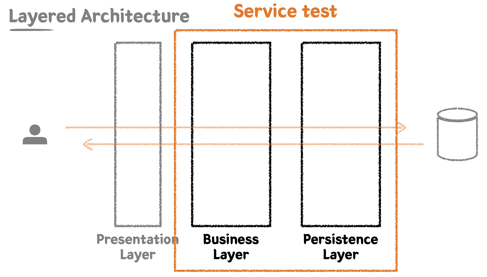

### Business Layer 테스트 1

Persistence Layer는 데이터 접근을 맡는 계층이다.  
해당 계층에는 비즈니스 로직이 개입되지 않아야 하고, 순수하게 데이터 CRUD에만 집중해야 한다.  
테스트도 이에 맞게 데이터 접근 자체에 대해서만 집중해야 한다.

Business Layer는 비즈니스 로직을 구현하는 계층이다.  
Persistence Layer를 통해 데이터를 읽고 쓰면서 비즈니스 로직을 전개해나가게 된다.  
또한 비즈니스 로직 단위로 작업의 원자성을 보장해야 하기 때문에, Business Layer 단에서 트랜잭션으로 작업을 묶어야 한다.

Business Layer에 대한 테스트를 작성할 때에는 Persistence Layer를 함께 묶어서 작성할 것이다.  
이를 통해 통합 테스트로 구성하여, 전체 객체가 의도한 대로 협력하여 동작하는지를 검증할 것이다.



먼저 새로운 요구사항을 추가해보자.  
이번엔 상품 번호 목록을 받아서 주문을 생성하는 기능을 구현해야 한다.  
주문은 주문 상태, 주문 등록 시간 정보를 가져야 하고, 주문의 총 금액 시간을 계산 가능해야 한다.

먼저 각각의 주문 상태를 나타내는 enum을 정의한다.

```java
package sample.cafekiosk.spring.domain.order;

@Getter
@RequiredArgsConstructor
public enum OrderStatus {

    INIT("주문생성"),
    CANCELED("주문취소"),
    PAYMENT_COMPLETED("결제완료"),
    PAYMENT_FAILED("결제실패"),
    RECEIVED("주문접수"),
    COMPLETED("처리완료");

    private final String text;

}
```

이제 Order와 Product 간 다대다 관계를 구성하기 위해, 중간 테이블 엔티티를 정의한다.  
중간 엔티티는 내부에 Order와 Product에 대한 참조를 가지고, @ManyToOne 설정이 되어있어야 한다.

```java
package sample.cafekiosk.spring.domain.orderproduct;

@Getter
@NoArgsConstructor(access = AccessLevel.PROTECTED)
@Entity
public class OrderProduct extends BaseEntity {

    @Id
    @GeneratedValue(strategy = GenerationType.IDENTITY)
    private Long id;

    @ManyToOne(fetch = FetchType.LAZY)
    private Order order;

    @ManyToOne(fetch = FetchType.LAZY)
    private Product product;

    public OrderProduct(Order order, Product product) {
        this.order = order;
        this.product = product;
    }

}
```

이제 Order 엔티티를 정의한다.  
Order에서는 자신에게 담긴 상품의 목록에 접근해야 하는 경우가 많다.  
따라서 Order와 OrderProduct가 양방향 관계를 가지도록 하기 위해, 내부에 OrderProduct 목록을 가지게 한다.

```java
package sample.cafekiosk.spring.domain.order;

@Getter
@NoArgsConstructor(access = AccessLevel.PROTECTED)
@Table(name = "orders")
@Entity
public class Order extends BaseEntity {

    @Id
    @GeneratedValue(strategy = GenerationType.IDENTITY)
    private Long id;

    @Enumerated(EnumType.STRING)
    private OrderStatus orderStatus;

    private int totalPrice;

    private LocalDateTime registeredDateTime;

    @OneToMany(mappedBy = "order", cascade = CascadeType.ALL)
    private List<OrderProduct> orderProducts = new ArrayList<>();

}
```

이제 주문에 대한 요청을 받는 OrderController를 구현한다.  
주문 생성 요청에 대한 request body 클래스를 정의하고, 컨트롤러에서는 이를 받아서 Service 계층에 주문 생성 요청을 하도록 구현한다.

```java
package sample.cafekiosk.spring.api.controller.order.request;

@Getter
public class OrderCreateRequest {

    private List<String> productNumbers;

    @Builder
    private OrderCreateRequest(List<String> productNumbers) {
        this.productNumbers = productNumbers;
    }

}
```

```java
package sample.cafekiosk.spring.api.controller.order;

@RequiredArgsConstructor
@RestController
public class OrderController {

    private final OrderService orderService;

    @PostMapping("/api/v1/orders/new")
    public void createOrder(@RequestBody OrderCreateRequest request) {
        LocalDateTime registeredDateTime = LocalDateTime.now();
        orderService.createOrder(request, registeredDateTime);
    }

}
```

이제 본격적으로 TDD 방식을 통해 서비스 계층을 구현해보자.  
먼저 다음과 같이 createOrder에 대한 테스트 코드를 작성한다.  
given에서는 주문에 넣을 각각의 Product 객체를 생성하고 레포지토리에 저장해야 한다.  
이 때 각 Product를 builder로 생성하기에는 지나치게 코드가 길어지므로, 도우미 메서드인 createProduct를 정의해서 사용한다.  
Product들을 저장한 후에는, 해당 상품들의 상품번호를 이용하여 OrderCreateRequest 객체를 생성한다.  
when에서는 주문 생성 메서드를 실행하고, then에서는 주문이 정상적으로 생성되었는지를 검증한다.

```java
package sample.cafekiosk.spring.api.service.order;

@ActiveProfiles("test")
@SpringBootTest
class OrderServiceTest {

    @Autowired
    private ProductRepository productRepository;

    @Autowired
    private OrderService orderService;

    @DisplayName("주문번호 리스트를 받아 주문을 생성한다.")
    @Test
    void createOrder() {
        // given
        LocalDateTime registeredDateTime = LocalDateTime.now();

        Product product1 = createProduct(HANDMADE, "001", 1000);
        Product product2 = createProduct(HANDMADE, "002", 3000);
        Product product3 = createProduct(HANDMADE, "003", 5000);
        productRepository.saveAll(List.of(product1, product2, product3));

        OrderCreateRequest request = OrderCreateRequest.builder()
                .productNumbers(List.of("001", "002"))
                .build();

        // when
        OrderResponse orderResponse = orderService.createOrder(request, registeredDateTime);

        // then
        assertThat(orderResponse.getId()).isNotNull();
        assertThat(orderResponse)
                .extracting("registeredDateTime", "totalPrice")
                .contains(registeredDateTime, 4000);
        assertThat(orderResponse.getProducts()).hasSize(2)
                .extracting("productNumber", "price")
                .containsExactlyInAnyOrder(
                        tuple("001", 1000),
                        tuple("002", 3000)
                );
    }

    private Product createProduct(ProductType type, String productNumber, int price) {
        return Product.builder()
                .type(type)
                .productNumber(productNumber)
                .price(price)
                .sellingStatus(SELLING)
                .name("메뉴 이름")
                .build();
    }
}
```

이 때 OrderResponse는 다음과 같이 정의한다.  
Order의 일부 프로퍼티들을 가지고 있고, 상품 목록의 경우 ProductResponse 타입으로 가지고 있다.

```java
package sample.cafekiosk.spring.api.service.order.response;

@Getter
public class OrderResponse {

    private Long id;
    private int totalPrice;
    private LocalDateTime registeredDateTime;
    private List<ProductResponse> products;

    @Builder
    private OrderResponse(Long id, int totalPrice, LocalDateTime registeredDateTime, List<ProductResponse> products) {
        this.id = id;
        this.totalPrice = totalPrice;
        this.registeredDateTime = registeredDateTime;
        this.products = products;
    }

    public static OrderResponse of(Order order) {
        return OrderResponse.builder()
                .id(order.getId())
                .totalPrice(order.getTotalPrice())
                .registeredDateTime(order.getRegisteredDateTime())
                .products(order.getOrderProducts().stream()
                        .map(orderProduct -> ProductResponse.of(orderProduct.getProduct()))
                        .collect(Collectors.toList())
                )
                .build();
    }
}
```

이제 최종적으로 OrderService를 구현해보자.

```java
package sample.cafekiosk.spring.api.service.order;

@RequiredArgsConstructor
@Service
public class OrderService {

    private final ProductRepository productRepository;
    private final OrderRepository orderRepository;

    public OrderResponse createOrder(OrderCreateRequest request, LocalDateTime registeredDateTime) {
        List<String> productNumbers = request.getProductNumbers();
        List<Product> products = productRepository.findAllByProductNumberIn(productNumbers);

        Order order = Order.create(products, registeredDateTime);
        Order savedOrder = orderRepository.save(order);
        return OrderResponse.of(savedOrder);
    }

}
```

서비스 계층을 구현하는 과정에서 product number를 바탕으로 Product 목록을 조회하는 레포지토리 계층의 메서드가 필요함이 확인되었다.  
이를 위해 다음과 같이 레포지토리에 메서드를 추가하고, 테스트를 작성한다.

```java
package sample.cafekiosk.spring.domain.product;

@Repository
public interface ProductRepository extends JpaRepository<Product, Long> {
    ...
    List<Product> findAllByProductNumberIn(List<String> productNumbers);
}
```

```java
package sample.cafekiosk.spring.domain.product;

@ActiveProfiles("test")
//@SpringBootTest
@DataJpaTest
class ProductRepositoryTest {

    @Autowired
    private ProductRepository productRepository;

    ...

    @DisplayName("상품번호 리스트로 상품들을 조회한다.")
    @Test
    void findAllByProductNumberIn() {
        // given
        Product product1 = Product.builder()
                .productNumber("001")
                .type(HANDMADE)
                .sellingStatus(SELLING)
                .name("아메리카노")
                .price(4000)
                .build();
        Product product2 = Product.builder()
                .productNumber("002")
                .type(HANDMADE)
                .sellingStatus(HOLD)
                .name("카페라떼")
                .price(4500)
                .build();
        Product product3 = Product.builder()
                .productNumber("003")
                .type(HANDMADE)
                .sellingStatus(STOP_SELLING)
                .name("팥빙수")
                .price(7000)
                .build();
        productRepository.saveAll(List.of(product1, product2, product3));

        // when
        List<Product> products = productRepository.findAllByProductNumberIn(List.of("001", "002"));

        // then
        assertThat(products).hasSize(2)
                .extracting("productNumber", "name", "sellingStatus")
                .containsExactlyInAnyOrder(
                        tuple("001", "아메리카노", SELLING),
                        tuple("002", "카페라떼", HOLD)
                );
    }
}
```

또한 product 리스트를 바탕으로 Order를 생성하는 메서드도 구현이 필요해졌다.  
생성일의 경우 LocalDateTime.now()를 내부적으로 사용하게 되면 테스트가 어려워지기 때문에, 이를 외부에 분리하기 위해 매개변수로 생성일을 받는 식으로 메서드를 구성해야 한다.

```java
package sample.cafekiosk.spring.domain.order;

@Getter
@NoArgsConstructor(access = AccessLevel.PROTECTED)
@Table(name = "orders")
@Entity
public class Order extends BaseEntity {

    @Id
    @GeneratedValue(strategy = GenerationType.IDENTITY)
    private Long id;

    @Enumerated(EnumType.STRING)
    private OrderStatus orderStatus;

    private int totalPrice;

    private LocalDateTime registeredDateTime;

    @OneToMany(mappedBy = "order", cascade = CascadeType.ALL)
    private List<OrderProduct> orderProducts = new ArrayList<>();

    public Order(List<Product> products, LocalDateTime registeredDateTime) {
        this.orderStatus = OrderStatus.INIT;
        this.totalPrice = calculateTotalPrice(products);
        this.registeredDateTime = registeredDateTime;
        this.orderProducts = products.stream()
                .map(product -> new OrderProduct(this, product))
                .collect(Collectors.toList());
    }

    public static Order create(List<Product> products, LocalDateTime registeredDateTime) {
        return new Order(products, registeredDateTime);
    }

    private int calculateTotalPrice(List<Product> products) {
        return products.stream()
                .mapToInt(Product::getPrice)
                .sum();
    }

}
```

이와 같이 Order의 팩터리 메서드에는 기본 orderStatus를 설정하고, 총 가격을 계산하고, 날짜를 받아서 저장하는 등의 로직이 들어가기 때문에, 이에 대해서도 단위 테스트가 필요하다.  
각 부분들에 대한 테스트 코드를 다음과 같이 작성한다.

```java
package sample.cafekiosk.spring.domain.order;

class OrderTest {

    @DisplayName("주문 생성 시 상품 리스트에서 주문의 총 금액을 계산한다.")
    @Test
    void calculateTotalPrice() {
        // given
        List<Product> products = List.of(
                createProduct("001", 1000),
                createProduct("002", 2000)
        );

        // when
        Order order = Order.create(products, LocalDateTime.now());

        // then
        assertThat(order.getTotalPrice()).isEqualTo(3000);
    }

    @DisplayName("주문 생성 시 주문 상태는 INIT이다.")
    @Test
    void init() {
        // given
        List<Product> products = List.of(
                createProduct("001", 1000),
                createProduct("002", 2000)
        );

        // when
        Order order = Order.create(products, LocalDateTime.now());

        // then
        assertThat(order.getOrderStatus()).isEqualByComparingTo(OrderStatus.INIT);
    }

    @DisplayName("주문 생성 시 주문 등록 시간을 기록한다.")
    @Test
    void registeredDateTime() {
        // given
        LocalDateTime registeredDateTime = LocalDateTime.now();
        List<Product> products = List.of(
                createProduct("001", 1000),
                createProduct("002", 2000)
        );

        // when
        Order order = Order.create(products, registeredDateTime);

        // then
        assertThat(order.getRegisteredDateTime()).isEqualTo(registeredDateTime);
    }

    private Product createProduct(String productNumber, int price) {
        return Product.builder()
                .type(HANDMADE)
                .productNumber(productNumber)
                .price(price)
                .sellingStatus(SELLING)
                .name("메뉴 이름")
                .build();
    }

}
```

Order에 대한 Repository는 다음과 같이 간단하게 구현한다.

```java
package sample.cafekiosk.spring.domain.order;

@Repository
public interface OrderRepository extends JpaRepository<Order, Long> {
}
```

### Business Layer 테스트 2

이제 OrderServiceTest에서 기존에 작성한 것 외의 케이스에 대한 테스트 코드를 작성해보자.  
요구사항에서 명확히 드러나진 않았지만, 중복된 음료가 주문되는 상황에 대한 케이스도 고려가 되어야 한다.

```java
@DisplayName("중복되는 상품번호 리스트로 주문을 생성할 수 있다.")
@Test
void createOrderWithDuplicateProductNumbers() {
    // given
    LocalDateTime registeredDateTime = LocalDateTime.now();

    Product product1 = createProduct(HANDMADE, "001", 1000);
    Product product2 = createProduct(HANDMADE, "002", 3000);
    Product product3 = createProduct(HANDMADE, "003", 5000);
    productRepository.saveAll(List.of(product1, product2, product3));

    OrderCreateRequest request = OrderCreateRequest.builder()
            .productNumbers(List.of("001", "001"))
            .build();

    // when
    OrderResponse orderResponse = orderService.createOrder(request, registeredDateTime);

    // then
    assertThat(orderResponse.getId()).isNotNull();
    assertThat(orderResponse)
            .extracting("registeredDateTime", "totalPrice")
            .contains(registeredDateTime, 2000);
    assertThat(orderResponse.getProducts()).hasSize(2)
            .extracting("productNumber", "price")
            .containsExactlyInAnyOrder(
                    tuple("001", 1000),
                    tuple("001", 1000)
            );
}
```

현재는 위 테스트 케이스가 실패한다.  
지금은 쿼리의 where ~ in 절로 조건을 넣어서 음료를 조회하고 있을 뿐이라서, 중복된 상황에 대한 고려가 되어있지 않다.
따라서 테스트가 통과되도록 하기 위해 프로덕션 코드 단에 로직을 추가해야 한다.

처음에는 동일하게 중복 제거된 형태로 Product를 조회한 후에, 이를 바탕으로 Map을 만들어서 상품코드를 기준으로 빠르게 상품을 조회할 수 있게 한다.  
이제 해당 Map을 이용하여 상품 코드 목록에 맞게 음료를 담아서 배열을 만들어주고, 배열을 이용하여 Order를 생성하도록 구현한다.

```java
package sample.cafekiosk.spring.api.service.order;

@RequiredArgsConstructor
@Service
public class OrderService {

    private final ProductRepository productRepository;
    private final OrderRepository orderRepository;

    public OrderResponse createOrder(OrderCreateRequest request, LocalDateTime registeredDateTime) {
        List<String> productNumbers = request.getProductNumbers();
        List<Product> products = findProductsBy(productNumbers);

        Order order = Order.create(products, registeredDateTime);
        Order savedOrder = orderRepository.save(order);
        return OrderResponse.of(savedOrder);
    }

    private List<Product> findProductsBy(List<String> productNumbers) {
        List<Product> products = productRepository.findAllByProductNumberIn(productNumbers);
        Map<String, Product> productMap = products.stream()
                .collect(Collectors.toMap(Product::getProductNumber, p -> p));

        return productNumbers.stream()
                .map(productMap::get)
                .collect(Collectors.toList());
    }
}
```

이제 정상적으로 테스트에 통과하게 된다.  
다만 이제 OrderServiceTest 안에 테스트가 2개 이상이 되면서, 각자 저장한 데이터가 서로에게 영향을 주게 되었다.  
OrderServiceTest에는 @SpringBootTest가 붙어 있는데, 여기에는 기본적으로 트랜잭션 및 롤백이 적용되지 않는다.  
(레포지토리 테스트에 붙은 @DataJpaTest는 @Transactional이 적용되어 트랜잭션 및 롤백이 적용된다.)  
따라서 다음과 같이 직접 데이터를 초기화 시켜주는 코드를 @AfterEach에 추가해야 한다.

```java
package sample.cafekiosk.spring.api.service.order;


@ActiveProfiles("test")
@SpringBootTest
class OrderServiceTest {

    @Autowired
    private ProductRepository productRepository;

    @Autowired
    private OrderRepository orderRepository;

    @Autowired
    private OrderProductRepository orderProductRepository;

    @Autowired
    private OrderService orderService;

    @AfterEach
    void tearDown() {
        orderProductRepository.deleteAllInBatch();
        productRepository.deleteAllInBatch();
        orderRepository.deleteAllInBatch();
    }

    @DisplayName("주문번호 리스트를 받아 주문을 생성한다.")
    @Test
    void createOrder() {
        ...
    }

    @DisplayName("중복되는 상품번호 리스트로 주문을 생성할 수 있다.")
    @Test
    void createOrderWithDuplicateProductNumbers() {
        ...
    }
}
```

이제 전체 어플리케이션이 잘 동작하는지 확인해보자.  
현재는 컨트롤러 단에 대한 테스트를 작성하지 않았기 때문에, 직접 API를 호출하여 확인해야 한다.  
IntelliJ에서는 http 파일을 생성하여 간단하게 API를 호출할 수 있다.

```http
### http/order.http

### 주문 신규 생성
POST localhost:8080/api/v1/orders/new
Content-Type: application/json

{
  "productNumbers": [
    "001",
    "002"
  ]
}
```

```http
### http/product.http

### 판매할 수 있는 상품 조회
GET localhost:8080/api/v1/products/selling
```

### Business Layer 테스트 3

이번엔 재고와 관련된 요구사항이 추가되었다고 하자.  
이제 주문 생성 시 재고를 확인하고, 재고를 차감한 후 주문을 생성하는 식으로 동작해야 한다.  
이 때 재고는 상품 번호를 가지고, 재고는 병 음료와 베이커리 상품에만 적용된다.

> 재고라는 개념을 도입할 경우, 실무에서는 동시성에 대한 고민이 반드시 필요하다.  
> 이를 optimistic lock / pessimistic lock 등의 개념을 이용하여 우선순위 기반의 락을 주거나 하는 식으로 해결해야 한다.  
> 예제에서는 단순화를 위해 동시성 문제는 배제하고 구현한다.

먼저 다음과 같이 재고가 있는 상품을 주문했을 때의 정상 케이스에 대한 테스트 코드를 작성한다.

```java
@DisplayName("재고와 관련된 상품이 포함되어 있는 주문번호 리스트를 받아 주문을 생성한다.")
@Test
void createOrderWithStock() {
    // given
    LocalDateTime registeredDateTime = LocalDateTime.now();

    Product product1 = createProduct(BOTTLE, "001", 1000);
    Product product2 = createProduct(BAKERY, "002", 3000);
    Product product3 = createProduct(HANDMADE, "003", 5000);
    productRepository.saveAll(List.of(product1, product2, product3));

    Stock stock1 = Stock.create("001", 2);
    Stock stock2 = Stock.create("002", 2);
    stockRepository.saveAll(List.of(stock1, stock2));

    OrderCreateRequest request = OrderCreateRequest.builder()
            .productNumbers(List.of("001", "001", "002", "003"))
            .build();

    // when
    OrderResponse orderResponse = orderService.createOrder(request, registeredDateTime);

    // then
    assertThat(orderResponse.getId()).isNotNull();
    assertThat(orderResponse)
            .extracting("registeredDateTime", "totalPrice")
            .contains(registeredDateTime, 10000);
    assertThat(orderResponse.getProducts()).hasSize(4)
            .extracting("productNumber", "price")
            .containsExactlyInAnyOrder(
                    tuple("001", 1000),
                    tuple("001", 1000),
                    tuple("002", 3000),
                    tuple("003", 5000)
            );

    List<Stock> stocks = stockRepository.findAll();
    assertThat(stocks).hasSize(2)
            .extracting("productNumber", "quantity")
            .containsExactlyInAnyOrder(
                    tuple("001", 0),
                    tuple("002", 1)
            );
}
```

이 때 새롭게 Stock 이라는 엔티티를 사용했다.  
Stock 엔티티는 다음과 같이 정의한다.

```java
package sample.cafekiosk.spring.domain.stock;

@Getter
@NoArgsConstructor(access = AccessLevel.PROTECTED)
@Entity
public class Stock extends BaseEntity {

    @Id
    @GeneratedValue(strategy = GenerationType.IDENTITY)
    private Long id;

    private String productNumber;

    private int quantity;

    @Builder
    private Stock(String productNumber, int quantity) {
        this.productNumber = productNumber;
        this.quantity = quantity;
    }

    public static Stock create(String productNumber, int quantity) {
        return Stock.builder()
                .productNumber(productNumber)
                .quantity(quantity)
                .build();
    }
}
```

이제 프로덕트 코드를 작성할 차례이다.  
서비스 단의 로직을 구현하는 과정에서, ProductType에 따라서 재고가 적용되는 제품인지를 확인하는 로직이 필요하다.  
이를 ProductType enum에 메서드로 정의한다.

```java
package sample.cafekiosk.spring.domain.product;

@Getter
@RequiredArgsConstructor
public enum ProductType {

    HANDMADE("제조 음료"),
    BOTTLE("병 음료"),
    BAKERY("베이커리");

    private final String text;

    public static boolean containsStockType(ProductType type) {
        return List.of(BOTTLE, BAKERY).contains(type);
    }
}
```

로직이 추가되었으므로, 이에 대한 테스트 코드도 작성해야 한다.  
재고 관련 타입인 경우와, 재고 관련 타입이 아닌 경우를 테스트한다.

```java
package sample.cafekiosk.spring.domain.product;

class ProductTypeTest {

    @DisplayName("상품 타입이 재고 관련 타입인지를 체크한다.")
    @Test
    void containsStockType() {
        // given
        ProductType givenType = ProductType.HANDMADE;

        // when
        boolean result = ProductType.containsStockType(givenType);

        // then
        assertThat(result).isFalse();
    }

    @DisplayName("상품 타입이 재고 관련 타입인지를 체크한다.")
    @Test
    void containsStockType2() {
        // given
        ProductType givenType = ProductType.BAKERY;

        // when
        boolean result = ProductType.containsStockType(givenType);

        // then
        assertThat(result).isTrue();
    }
}
```

또한 StockRepository에 productNumber로 재고를 조회하는 로직이 필요하다.  
마찬가지로 추가한 후, 테스트 코드를 작성한다.

```java
package sample.cafekiosk.spring.domain.stock;

@Repository
public interface StockRepository extends JpaRepository<Stock, Long> {
    List<Stock> findAllByProductNumberIn(List<String> productNumbers);
}
```

```java
package sample.cafekiosk.spring.domain.stock;

@DataJpaTest
class StockRepositoryTest {

    @Autowired
    private StockRepository stockRepository;

    @DisplayName("상품번호 리스트로 재고를 조회한다.")
    @Test
    void findAllByProductNumberIn() {
        // given
        Stock stock1 = Stock.create("001", 1);
        Stock stock2 = Stock.create("002", 2);
        Stock stock3 = Stock.create("003", 3);
        stockRepository.saveAll(List.of(stock1, stock2, stock3));

        // when
        List<Stock> stocks = stockRepository.findAllByProductNumberIn(List.of("001", "002"));

        // then
        assertThat(stocks).hasSize(2)
                .extracting("productNumber", "quantity")
                .containsExactlyInAnyOrder(
                        tuple("001", 1),
                        tuple("002", 2)
                );
    }
}
```

또한 Stock이 가진 재고보다, 현재 주문하려고 하는 상품의 수량이 많은지를 확인하는 로직도 필요하다.  
이는 Stock 엔티티 내부에 메서드로 구현한다.  
마찬가지로 테스트 코드가 필요하다.

```java
package sample.cafekiosk.spring.domain.stock;

@Getter
@NoArgsConstructor(access = AccessLevel.PROTECTED)
@Entity
public class Stock extends BaseEntity {
    ...

    public boolean isQuantityLessThan(int quantity) {
        return this.quantity < quantity;
    }

    public void deductQuantity(int quantity) {
        if (isQuantityLessThan(quantity)) {
            throw new IllegalArgumentException("차감할 재고 수량이 없습니다.");
        }
        this.quantity -= quantity;
    }
}
```

```java
package sample.cafekiosk.spring.domain.stock;

class StockTest {

    @DisplayName("재고의 수량이 제공된 수량보다 작은지 확인한다.")
    @Test
    void isQuantityLessThan() {
        // given
        Stock stock = Stock.create("001", 1);
        int quantity = 2;

        // when
        boolean result = stock.isQuantityLessThan(quantity);

        // then
        assertThat(result).isTrue();
    }

    @DisplayName("재고를 주어진 개수만큼 차감할 수 있다.")
    @Test
    void deductQuantity() {
        // given
        Stock stock = Stock.create("001", 1);
        int quantity = 1;

        // when
        stock.deductQuantity(quantity);

        // then
        assertThat(stock.getQuantity()).isZero();
    }

    @DisplayName("재고보다 많은 수의 수량으로 차감 시도하는 경우 예외가 발생한다.")
    @Test
    void deductQuantity2() {
        // given
        Stock stock = Stock.create("001", 1);
        int quantity = 2;

        // when // then
        assertThatThrownBy(() -> stock.deductQuantity(quantity))
                .isInstanceOf(IllegalArgumentException.class)
                .hasMessage("차감할 재고 수량이 없습니다.");
    }
}
```

최종적으로 주문을 생성하는 서비스 로직은 다음과 같이 구현된다.  
재고를 차감하는 로직은 deductStockQuantities 메서드로 분리했다.  
먼저 주문 상품 목록에서 재고가 적용되는 상품의 상품 번호 목록을 추출했다.  
이를 이용하여 <주문 번호, Stock> 형태의 맵과 <주문 번호, 주문 수량> 형태의 맵을 만들었다.  
이제 상품 번호 목록을 HashSet으로 만들어 중복을 제거하고, 각 상품 번호들을 순회하면서 재고를 차감하는 식으로 구현했다.

> stream을 통해서 데이터를 가공하는 로직의 경우, 별도의 메서드로 분리하면 좋다.  
> 이를 통해 해당 로직에 대해서 명명해 두면, 이후에 로직을 이해하기가 훨씬 수월하다.

```java
package sample.cafekiosk.spring.api.service.order;

@Transactional
@RequiredArgsConstructor
@Service
public class OrderService {

    private final ProductRepository productRepository;
    private final OrderRepository orderRepository;
    private final StockRepository stockRepository;

    public OrderResponse createOrder(OrderCreateRequest request, LocalDateTime registeredDateTime) {
        List<String> productNumbers = request.getProductNumbers();
        List<Product> products = findProductsBy(productNumbers);

        deductStockQuantities(products);

        Order order = Order.create(products, registeredDateTime);
        Order savedOrder = orderRepository.save(order);
        return OrderResponse.of(savedOrder);
    }

    private void deductStockQuantities(List<Product> products) {
        List<String> stockProductNumbers = extractStockProductNumbers(products);

        Map<String, Stock> stockMap = createStockMapBy(stockProductNumbers);
        Map<String, Long> productCountingMap = createCountingMapBy(stockProductNumbers);

        for (String stockProductNumber : new HashSet<>(stockProductNumbers)) {
            Stock stock = stockMap.get(stockProductNumber);
            int quantity = productCountingMap.get(stockProductNumber).intValue();

            if (stock.isQuantityLessThan(quantity)) {
                throw new IllegalArgumentException("재고가 부족한 상품이 있습니다.");
            }
            stock.deductQuantity(quantity);
        }
    }

    private List<Product> findProductsBy(List<String> productNumbers) {
        List<Product> products = productRepository.findAllByProductNumberIn(productNumbers);
        Map<String, Product> productMap = products.stream()
                .collect(Collectors.toMap(Product::getProductNumber, p -> p));

        return productNumbers.stream()
                .map(productMap::get)
                .collect(Collectors.toList());
    }

    private static List<String> extractStockProductNumbers(List<Product> products) {
        return products.stream()
                .filter(product -> ProductType.containsStockType(product.getType()))
                .map(Product::getProductNumber)
                .collect(Collectors.toList());
    }

    private Map<String, Stock> createStockMapBy(List<String> stockProductNumbers) {
        List<Stock> stocks = stockRepository.findAllByProductNumberIn(stockProductNumbers);
        return stocks.stream()
                .collect(Collectors.toMap(Stock::getProductNumber, s -> s));
    }

    private static Map<String, Long> createCountingMapBy(List<String> stockProductNumbers) {
        return stockProductNumbers.stream()
                .collect(Collectors.groupingBy(p -> p, Collectors.counting()));
    }
}
```

재고 부족에 대한 서비스 단의 테스트 케이스는 아직 작성하지 않은 상태이다.  
테스트를 추가해보자.

```java
@DisplayName("재고가 부족한 상품으로 주문을 생성하려는 경우 예외가 발생한다.")
@Test
void createOrderWithNoStock() {
    // given
    LocalDateTime registeredDateTime = LocalDateTime.now();

    Product product1 = createProduct(BOTTLE, "001", 1000);
    Product product2 = createProduct(BAKERY, "002", 3000);
    Product product3 = createProduct(HANDMADE, "003", 5000);
    productRepository.saveAll(List.of(product1, product2, product3));

    Stock stock1 = Stock.create("001", 2);
    Stock stock2 = Stock.create("002", 2);
    stock1.deductQuantity(1); // todo
    stockRepository.saveAll(List.of(stock1, stock2));

    OrderCreateRequest request = OrderCreateRequest.builder()
            .productNumbers(List.of("001", "001", "002", "003"))
            .build();

    // when // then
    assertThatThrownBy(() -> orderService.createOrder(request, registeredDateTime))
            .isInstanceOf(IllegalArgumentException.class)
            .hasMessage("재고가 부족한 상품이 있습니다.");
}
```

### 테스트 클래스에 @Transactional을 붙일 경우 주의할 점

지금까지는 OrderServiceTest에 @Transactional을 붙이지 않고, @AfterEach를 통해 각 테스트 케이스가 끝난 시점에 수동으로 데이터를 초기화하는 식으로 구현했다.

```java
package sample.cafekiosk.spring.api.service.order;

@ActiveProfiles("test")
@SpringBootTest
class OrderServiceTest {

    @Autowired
    private ProductRepository productRepository;

    @Autowired
    private OrderRepository orderRepository;

    @Autowired
    private OrderProductRepository orderProductRepository;

    @Autowired
    private StockRepository stockRepository;

    @Autowired
    private OrderService orderService;

    @AfterEach
    void tearDown() {
        orderProductRepository.deleteAllInBatch();
        productRepository.deleteAllInBatch();
        orderRepository.deleteAllInBatch();
        stockRepository.deleteAllInBatch();
    }
    ...
}
```

만약 @Transactional을 테스트 클래스에 붙이면, 각 테스트 케이스에 대해서 트랜잭션이 시작되고, 테스트가 끝나면 롤백되어 데이터가 초기화된다.  
따라서 위와 같이 데이터를 일일이 초기화할 필요가 없어지기 때문에 매우 간편하다.  
하지만 주의해야 할 점은, 테스트 단에서 @Transactional을 붙이게 되면 테스트 대상 메서드(예시에서는 서비스 메서드)에 트랜잭션이 적용되어 있는지가 검증되지 않는다는 것이다.  
예를 들어 위 예시에서 OrderService에 @Transactional을 붙이지 않았다고 하더라도, OrderServiceTest에서 트랜잭션을 적용하기 때문에 테스트에는 통과하게 된다.  
만약 OrderServiceTest에서 트랜잭션을 적용하지 않았다면, JPA의 변경 감지 기능이 제대로 작동하지 않아서 테스트에 실패하여 오류를 잡아낼 수 있었을 것이다.
