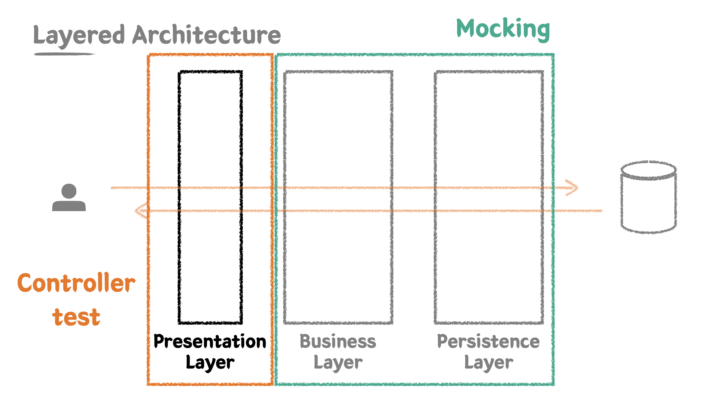

### Presentation Layer 테스트 1 - 상품 등록 기능 추가하기

Presentation Layer는 가장 먼저 사용자(클라이언트)의 요청을 받는 계층이다.  
Presentation Layer의 테스트에서는 사용자의 요청을 validation 하는 부분을 가장 주요하게 다뤄야 한다.  
해당 부분에 집중하기 위해 Presentation Layer의 테스트는 단위 테스트 형식으로 작성할 것이다.
하위에 존재하는 Business Layer와 Persistence Layer는 Mocking 처리하면 된다.  



Mock은 가짜, 대역이라는 의미를 가지고 있다.  
테스트 대상에만 집중하고 싶을 때, 다른 부분은 가짜로 정상 동작하는 것처럼 처리하는 방식이다.  
스프링 프레임워크에서는 스프링 MVC 동작을 재현할 수 있도록 지원하는 MockMvc를 제공한다.  
이를 이용하여 Presentation Layer에 대한 테스트를 작성해보자.

이번에는 상품 등록 기능에 대한 요구 사항이 추가되었다고 가정하자.  
상품명, 상품 타입, 판매 상태, 가격을 입력받아서 상품을 등록하는 기능을 구현해야 한다.

먼저 컨트롤러 단에 다음과 같이 api를 추가한다.

```java
package sample.cafekiosk.spring.api.controller.product;

@RequiredArgsConstructor
@RestController
public class ProductController {

    private final ProductService productService;

    @PostMapping("/api/v1/products/new")
    public void createProduct(@RequestBody ProductCreateRequest request) {
        productService.createProduct(request);
    }

    ...
}
```

컨트롤러 단에서 요청 받는 데이터 타입을 ProductCreateRequest dto로 정의한다.  
이 때 편리하게 Product 엔티티로 변환할 수 있도록 toEntity 메서드를 정의한다.

```java
package sample.cafekiosk.spring.api.controller.product.dto.request;

@Getter
@NoArgsConstructor
public class ProductCreateRequest {

    private ProductType type;
    private ProductSellingStatus sellingStatus;
    private String name;
    private int price;

    @Builder
    private ProductCreateRequest(ProductType type, ProductSellingStatus sellingStatus, String name, int price) {
        this.type = type;
        this.sellingStatus = sellingStatus;
        this.name = name;
        this.price = price;
    }

    public Product toEntity(String nextProductNumber) {
        return Product.builder()
                .productNumber(nextProductNumber)
                .type(type)
                .sellingStatus(sellingStatus)
                .name(name)
                .price(price)
                .build();
    }
}
```

ProductCreateRequest에서는 id, productNumber를 제외한 Product 정보를 받는다.  
productNumber는 가장 최근 생성한 상품의 productNumber에 1을 더한 값을 부여하도록 서비스 단에 구현할 것이다.  
이를 위해 레포지토리 단에 가장 최근의 productNumber를 조회하는 메서드를 추가한다.

```java
package sample.cafekiosk.spring.domain.product;

@Repository
public interface ProductRepository extends JpaRepository<Product, Long> {

    ...
    @Query(value = "select p.product_number from product p order by id desc limit 1", nativeQuery = true)
    String findLatestProductNumber();
}
```

이에 대한 테스트 코드를 작성한다.  
정상 케이스와 함께, 저장된 상품이 하나도 없는 경우에 대한 테스트도 추가한다.

```java
package sample.cafekiosk.spring.domain.product;

@ActiveProfiles("test")
//@SpringBootTest
@DataJpaTest
class ProductRepositoryTest {

    @Autowired
    private ProductRepository productRepository;

    ...

    @DisplayName("가장 마지막으로 저장한 상품의 상품번호를 읽어온다.")
    @Test
    void findLatestProductNumber() {
        // given
        String targetProductNumber = "003";

        Product product1 = createProduct("001", HANDMADE, SELLING, "아메리카노", 4000);
        Product product2 = createProduct("002", HANDMADE, HOLD, "카페라떼", 4500);
        Product product3 = createProduct(targetProductNumber, HANDMADE, STOP_SELLING, "팥빙수", 7000);
        productRepository.saveAll(List.of(product1, product2, product3));

        // when
        String latestProductNumber = productRepository.findLatestProductNumber();

        // then
        assertThat(latestProductNumber).isEqualTo(targetProductNumber);
    }

    @DisplayName("가장 마지막으로 저장한 상품의 상품번호를 읽어올 때, 상품이 하나도 없는 경우에는 null을 반환한다.")
    @Test
    void findLatestProductNumberWhenProductIsEmpty() {
        // when
        String latestProductNumber = productRepository.findLatestProductNumber();

        // then
        assertThat(latestProductNumber).isNull();
    }

    private Product createProduct(String productNumber, ProductType type, ProductSellingStatus sellingStatus, String name, int price) {
        return Product.builder()
                .productNumber(productNumber)
                .type(type)
                .sellingStatus(sellingStatus)
                .name(name)
                .price(price)
                .build();
    }
}
```

이제 ProductService에 상품 등록 로직을 구현해보자.  
TDD 방식으로 진행하기 위해 먼저 테스트 코드를 작성한다.  
기존에 상품이 있는 경우와 없는 경우에 대한 테스트 케이스를 별도로 작성한다.

```java
package sample.cafekiosk.spring.api.service.product;

@ActiveProfiles("test")
@SpringBootTest
class ProductServiceTest {

    @Autowired
    private ProductService productService;

    @Autowired
    private ProductRepository productRepository;

    @AfterEach
    void tearDown() {
        productRepository.deleteAllInBatch();
    }

    @DisplayName("신규 상품을 등록한다. 상품번호는 가장 최근 상품의 상품번호에서 1 증가한 값이다.")
    @Test
    void createProduct() {
        // given
        Product product = createProduct("001", HANDMADE, SELLING, "아메리카노", 4000);
        productRepository.save(product);

        ProductCreateRequest request = ProductCreateRequest.builder()
                .type(HANDMADE)
                .sellingStatus(SELLING)
                .name("카푸치노")
                .price(5000)
                .build();

        // when
        ProductResponse productResponse = productService.createProduct(request);

        // then
        assertThat(productResponse)
                .extracting("productNumber", "type", "sellingStatus", "name", "price")
                .contains("002", HANDMADE, SELLING, "카푸치노", 5000);

        List<Product> products = productRepository.findAll();
        assertThat(products).hasSize(2)
                .extracting("productNumber", "type", "sellingStatus", "name", "price")
                .containsExactlyInAnyOrder(
                        tuple("001", HANDMADE, SELLING, "아메리카노", 4000),
                        tuple("002", HANDMADE, SELLING, "카푸치노", 5000)
                );
    }

    @DisplayName("상품이 하나도 없는 경우 신규 상품을 등록하면 상품번호는 001이다.")
    @Test
    void createProductWhenProductsIsEmpty() {
        // given
        ProductCreateRequest request = ProductCreateRequest.builder()
                .type(HANDMADE)
                .sellingStatus(SELLING)
                .name("카푸치노")
                .price(5000)
                .build();

        // when
        ProductResponse productResponse = productService.createProduct(request);

        // then
        assertThat(productResponse)
                .extracting("productNumber", "type", "sellingStatus", "name", "price")
                .contains("001", HANDMADE, SELLING, "카푸치노", 5000);

        List<Product> products = productRepository.findAll();
        assertThat(products).hasSize(1)
                .extracting("productNumber", "type", "sellingStatus", "name", "price")
                .contains(
                        tuple("001", HANDMADE, SELLING, "카푸치노", 5000)
                );
    }

    private Product createProduct(String productNumber, ProductType type, ProductSellingStatus sellingStatus, String name, int price) {
        return Product.builder()
                .productNumber(productNumber)
                .type(type)
                .sellingStatus(sellingStatus)
                .name(name)
                .price(price)
                .build();
    }

}
```

이제 해당 테스트를 통과하는 프로덕션 코드를 다음과 같이 작성한다.  
등록할 productNumber를 생성하는 로직은 별도의 private 메서드로 분리한다.

```java
package sample.cafekiosk.spring.api.service.product;

@Transactional(readOnly = true)
@RequiredArgsConstructor
@Service
public class ProductService {

    private final ProductRepository productRepository;

    @Transactional
    public ProductResponse createProduct(ProductCreateRequest request) {
        String nextProductNumber = createNextProductNumber();

        Product product = request.toEntity(nextProductNumber);
        Product savedProduct = productRepository.save(product);

        return ProductResponse.of(savedProduct);
    }

    private String createNextProductNumber() {
        String latestProductNumber = productRepository.findLatestProductNumber();
        if (latestProductNumber == null) {
            return "001";
        }

        int latestProductNumberInt = Integer.parseInt(latestProductNumber);
        int nextProductNumberInt = latestProductNumberInt + 1;

        return String.format("%03d", nextProductNumberInt);
    }

}
```

### @Transactional readOnly 적용하기

CQRS는 데이터 저장소의 Command(쓰기)와 Query(읽기) 작업을 분리하는 패턴이다.  
쓰기 작업과 읽기 작업을 분리하면, 각 작업 별로 요청을 보낼 database를 분리하는 것이 가능해진다.  
이를 통해 한 쪽에서 장애가 발생했더라도, 다른 종류의 작업에는 영향을 미치지 않도록 할 수 있다.

스프링에서는 @Transactional의 readOnly 옵션으로 해당 작업이 읽기 전용인지를 지정할 수 있다.  
JPA에서는 readOnly 트랜잭션이 적용된 경우, 변경 감지를 위한 스냅샷 저장 등을 하지 않기 때문에 성능 면에서 이점이 있다.  
하나의 서비스 안에서 읽기 작업과 쓰기 작업이 동시에 존재한다면, 클래스 단에서 기본으로 readOnly=true로 적용하고, 메서드에서 개별적으로 쓰기가 가능하게 적용하는 편이 좋다.

```java
package sample.cafekiosk.spring.api.service.product;

@Transactional(readOnly = true)
@RequiredArgsConstructor
@Service
public class ProductService {

    private final ProductRepository productRepository;

    @Transactional
    public ProductResponse createProduct(ProductCreateRequest request) {
        ...
    }

    public List<ProductResponse> getSellingProducts() {
        ...
    }
}
```

### Presentation Layer 테스트 2 - validation 적용, controller 테스트

이제 본격적으로 컨트롤러 단에 대한 테스트를 작성해보자.  
테스트에서는 Mockito 라이브러리를 사용하여 컨트롤러 하위의 계층들을 Mocking 처리할 것이다.  

먼저 테스트 클래스에 @WebMvcTest를 붙여서, 컨트롤러 단의 테스트를 위한 최소한의 빈만 등록하도록 한다.  
다만 @WebMvcTest를 붙일 경우 Auditing 기능을 위한 빈들이 정상 등록 되지 않는 문제가 있다.  
이로 인해 SpringApplication에 @EnableJpaAuditing이 붙어있는 경우 테스트 실행 과정에서 스프링 서버를 띄우는데 실패한다.  
이를 해결하기 위해 @EnableJpaAuditing이 붙은 Config를 별도로 등록하여, 실제 앱 실행 시에만 Auditing 기능을 사용하도록 설정한다.

```java
package sample.cafekiosk.spring;

@SpringBootApplication
public class CafekioskApplication {
    public static void main(String[] args) {
        SpringApplication.run(CafekioskApplication.class, args);
    }
}
```

```java
package sample.cafekiosk.spring.config;

@EnableJpaAuditing
@Configuration
public class JpaAuditingConfig {
}
```

이제 테스트 클래스를 작성해보자.  
컨트롤러 내에서 사용하는 하위 계층(ProductService)은 @MockBean을 통해 Mock 객체로 등록한다.  
테스트 클래스에 @WebMvcTest를 붙이면 컨트롤러 하위의 빈들이 컨테이너에 등록되지 않는다.  
따라서 테스트 내에서 MockBean을 직접 등록하지 않으면 예외가 발생한다.

테스트 메서드에서는 주입받은 MockMvc를 이용해서 테스트를 진행한다.  
mockMvc.perform을 통해서 api 요청을 보내는 것처럼 테스트를 할 수 있다.  
post 요청에서는 .content()를 통해 request body를 넘길 수 있는데, ObjectMapper를 통해 직접 문자열화 해서 넘겨줘야 한다.  
이렇게 요청을 보낸 것에 대하여 andExpect 절에서 응답 상태 코드를 검증한다.

```java
package sample.cafekiosk.spring.api.controller.product;

@WebMvcTest(controllers = ProductController.class)
class ProductControllerTest {

    @Autowired
    private MockMvc mockMvc;

    @Autowired
    private ObjectMapper objectMapper;

    @MockBean
    private ProductService productService;

    @DisplayName("신규 상품을 등록한다.")
    @Test
    void createProduct() throws Exception {
        // given
        ProductCreateRequest request = ProductCreateRequest.builder()
            .type(ProductType.HANDMADE)
            .sellingStatus(ProductSellingStatus.SELLING)
            .name("아메리카노")
            .price(4000)
            .build();

        // when // then
        mockMvc.perform(
                post("/api/v1/products/new")
                    .content(objectMapper.writeValueAsString(request))
                    .contentType(MediaType.APPLICATION_JSON)
            )
            .andDo(print())
            .andExpect(status().isOk());
    }
}
```

기본 요청이 정상적으로 처리되는 것을 확인할 수 있다.  
앞서 말했듯, Presentation Layer에서는 사용자 input에 대한 validation이 제대로 이루어지는지를 테스트해야 한다.  
spring의 validation 기능을 사용하기 위해 먼저 다음의 의존성을 추가한다.

```gradle
dependencies {
    ...
    implementation 'org.springframework.boot:spring-boot-starter-validation'
}
```

이제 request dto에서 annotation 기반으로 validation을 적용할 수 있다.  
다음과 같이 dto의 각 프로퍼티에 validation annotation을 달면 된다.

```java
package sample.cafekiosk.spring.api.controller.product.dto.request;

...
import javax.validation.constraints.NotBlank;
import javax.validation.constraints.NotNull;
import javax.validation.constraints.Positive;

@Getter
@NoArgsConstructor
public class ProductCreateRequest {
    @NotNull(message = "상품 타입은 필수입니다.")
    private ProductType type;

    @NotNull(message = "상품 판매상태는 필수입니다.")
    private ProductSellingStatus sellingStatus;

    @NotBlank(message = "상품 이름은 필수입니다.")
    private String name;

    @Positive(message = "상품 가격은 양수여야 합니다.")
    private int price;

    ...
}
```

이제 컨트롤러 단의 매개변수에서 @Valid를 달아서, 해당 dto에 대한 validation이 이루어지도록 한다.

```java
package sample.cafekiosk.spring.api.controller.product;

@RequiredArgsConstructor
@RestController
public class ProductController {

    private final ProductService productService;

    @PostMapping("/api/v1/products/new")
    public ProductResponse createProduct(@Valid @RequestBody ProductCreateRequest request) {
        return productService.createProduct(request);
    }
    ...
}
```

또한 컨트롤러에서 응답 시 metadata를 포함한 규격화된 데이터를 전달하도록 개선해보자.  
다음과 같이 공통으로 사용할 ApiResponse 객체를 정의한다.  
기본적으로 사용할 of 팩터리 메서드를 정의하고, 자주 사용하는 ok 응답은 간단하게 사용할 수 있도록 별도로 정의한다.

```java
package sample.cafekiosk.spring.api;

@Getter
public class ApiResponse<T> {

    private int code;
    private HttpStatus status;
    private String message;
    private T data;

    public ApiResponse(HttpStatus status, String message, T data) {
        this.code = status.value();
        this.status = status;
        this.message = message;
        this.data = data;
    }

    public static <T> ApiResponse<T> of(HttpStatus httpStatus, String message, T data) {
        return new ApiResponse<>(httpStatus, message, data);
    }

    public static <T> ApiResponse<T> of(HttpStatus httpStatus, T data) {
        return of(httpStatus, httpStatus.name(), data);
    }

    public static <T> ApiResponse<T> ok(T data) {
        return of(HttpStatus.OK, data);
    }
}
```

요청 처리 과정에서 예외가 발생했을 경우에는 @ControllerAdvice를 적용한 Advice 객체에서 전역적으로 catch 해서 예외 응답을 보내주도록 구현할 수 있다.  
spring validation에 실패할 경우 BindException이 발생하므로, 해당 예외에 대해서 Bad Request 응답을 보내도록 구현한다.  
Advice 객체의 메서드에  @ExceptionHandler(BindException.class)를 적용하면 해당 예외가 발생했을 때 메서드가 실행된다.  
이 때 메서드에 @ResponseStatus(HttpStatus.BAD_REQUEST)를 추가로 달면, 반환 값을 response body에 담아서 400 상태 코드로 에러 응답을 보낸다.  
메서드 내에서는 e.getBindingResult()를 통해 어떤 validation에 실패했는지를 추출해서, ApiResponse의 메시지에 담아 반환한다.

```java
package sample.cafekiosk.spring.api;

@RestControllerAdvice
public class ApiControllerAdvice {
    @ResponseStatus(HttpStatus.BAD_REQUEST)
    @ExceptionHandler(BindException.class)
    public ApiResponse<Object> bindException(BindException e) {
        return ApiResponse.of(
            HttpStatus.BAD_REQUEST,
            e.getBindingResult().getAllErrors().get(0).getDefaultMessage(),
            null
        );
    }
}
```

이제 각 validation에 대한 테스트 코드를 작성해보자.  
ProductCreateRequest에는 총 4개의 프로퍼티에 대한 validation이 수행되므로, 각각의 위반 케이스에 대한 테스트를 작성한다.  
정상적으로 에러 응답이 오는지 확인하고, andExpect(jsonPath("$.xxx").value("yyy"))를 통해 응답값의 각 프로퍼티를 검증한다.

```java
package sample.cafekiosk.spring.api.controller.product;

@WebMvcTest(controllers = ProductController.class)
class ProductControllerTest {
    ...

    @DisplayName("신규 상품을 등록할 때 상품 타입은 필수값이다.")
    @Test
    void createProductWithoutType() throws Exception {
        // given
        ProductCreateRequest request = ProductCreateRequest.builder()
            .sellingStatus(ProductSellingStatus.SELLING)
            .name("아메리카노")
            .price(4000)
            .build();

        // when // then
        mockMvc.perform(
                post("/api/v1/products/new")
                    .content(objectMapper.writeValueAsString(request))
                    .contentType(MediaType.APPLICATION_JSON)
            )
            .andDo(print())
            .andExpect(status().isBadRequest())
            .andExpect(jsonPath("$.code").value("400"))
            .andExpect(jsonPath("$.status").value("BAD_REQUEST"))
            .andExpect(jsonPath("$.message").value("상품 타입은 필수입니다."))
            .andExpect(jsonPath("$.data").isEmpty())
        ;
    }

    @DisplayName("신규 상품을 등록할 때 상품 판매상태는 필수값이다.")
    @Test
    void createProductWithoutSellingStatus() throws Exception {
        // given
        ProductCreateRequest request = ProductCreateRequest.builder()
            .type(ProductType.HANDMADE)
            .name("아메리카노")
            .price(4000)
            .build();

        // when // then
        mockMvc.perform(
                post("/api/v1/products/new")
                    .content(objectMapper.writeValueAsString(request))
                    .contentType(MediaType.APPLICATION_JSON)
            )
            .andDo(print())
            .andExpect(status().isBadRequest())
            .andExpect(jsonPath("$.code").value("400"))
            .andExpect(jsonPath("$.status").value("BAD_REQUEST"))
            .andExpect(jsonPath("$.message").value("상품 판매상태는 필수입니다."))
            .andExpect(jsonPath("$.data").isEmpty())
        ;
    }

    @DisplayName("신규 상품을 등록할 때 상품 이름은 필수값이다.")
    @Test
    void createProductWithoutName() throws Exception {
        // given
        ProductCreateRequest request = ProductCreateRequest.builder()
            .type(ProductType.HANDMADE)
            .sellingStatus(ProductSellingStatus.SELLING)
            .price(4000)
            .build();

        // when // then
        mockMvc.perform(
                post("/api/v1/products/new")
                    .content(objectMapper.writeValueAsString(request))
                    .contentType(MediaType.APPLICATION_JSON)
            )
            .andDo(print())
            .andExpect(status().isBadRequest())
            .andExpect(jsonPath("$.code").value("400"))
            .andExpect(jsonPath("$.status").value("BAD_REQUEST"))
            .andExpect(jsonPath("$.message").value("상품 이름은 필수입니다."))
            .andExpect(jsonPath("$.data").isEmpty())
        ;
    }

    @DisplayName("신규 상품을 등록할 때 상품 가격은 양수이다.")
    @Test
    void createProductWithZeroPrice() throws Exception {
        // given
        ProductCreateRequest request = ProductCreateRequest.builder()
            .type(ProductType.HANDMADE)
            .sellingStatus(ProductSellingStatus.SELLING)
            .name("아메리카노")
            .price(0)
            .build();

        // when // then
        mockMvc.perform(
                post("/api/v1/products/new")
                    .content(objectMapper.writeValueAsString(request))
                    .contentType(MediaType.APPLICATION_JSON)
            )
            .andDo(print())
            .andExpect(status().isBadRequest())
            .andExpect(jsonPath("$.code").value("400"))
            .andExpect(jsonPath("$.status").value("BAD_REQUEST"))
            .andExpect(jsonPath("$.message").value("상품 가격은 양수여야 합니다."))
            .andExpect(jsonPath("$.data").isEmpty())
        ;
    }
}
```

지금까지는 post 요청에 대한 테스트 코드를 작성했다.  
이번에는 판매 중인 상품을 조회하는 get 요청에 대한 테스트 코드를 추가로 작성해보자.  
먼저 controller의 메서드에서 ApiResponse로 감싸서 응답 객체를 반환하도록 수정한다.

```java
package sample.cafekiosk.spring.api.controller.product;

@RequiredArgsConstructor
@RestController
public class ProductController {

    private final ProductService productService;

    ...

    @GetMapping("/api/v1/products/selling")
    public ApiResponse<List<ProductResponse>> getSellingProducts() {
        return ApiResponse.ok(productService.getSellingProducts());
    }

}
```

이제 mockMvc를 이용하여 get 요청을 보내고, 이에 대한 결과를 검증한다.  
이 때 productService를 Mocking하여 getSellingProducts()를 호출하면 빈 배열을 반환하도록 한다.

```java
@DisplayName("판매 상품을 조회한다.")
@Test
void getSellingProducts() throws Exception {
    // given
    List<ProductResponse> result = List.of();

    when(productService.getSellingProducts()).thenReturn(result);

    // when // then
    mockMvc.perform(
            get("/api/v1/products/selling")
        )
        .andDo(print())
        .andExpect(status().isOk())
        .andExpect(jsonPath("$.code").value("200"))
        .andExpect(jsonPath("$.status").value("OK"))
        .andExpect(jsonPath("$.message").value("OK"))
        .andExpect(jsonPath("$.data").isArray());
}
```

### Spring Validation 적용 시 주의할 점

validation annotation을 적용할 때 주의할 점이 있다.  

문자열에 대한 validation에는 총 3개의 어노테이션을 적용할 수 있다. - @NotNull, @NotEmpty, @NotBlank  
먼저 @NotNull의 경우 Null만 아니면 "", " " 등의 문자열은 모두 통과 시킨다.  
@NotEmpty는 빈 문자열("")는 막지만, 공백이 들어간 문자열(" ")은 통과한다.  
@NotBlank는 빈 문자열("")과 공백 문자열(" ")을 모두 막는다.  
보통의 상황에서는 공백을 통과시킬 이유가 없기 때문에, @NotBlank를 많이 사용한다.

또한 validation의 관심사 분리도 고려해 보면 좋다.  
예를 들어 name 필드를 NotBlank + 최대 길이 20자로 제한하고 싶다고 하자.  
이 경우 컨트롤러 단의 request dto에 다음과 같이 어노테이션으로 처리할 수 있다.

```java
@NotBlank
@Max(20)
private String name;
```

하지만 컨트롤러 단에서 최대 길이 제한까지 검증하는 것이 적절한지 고민해 볼 필요가 있다.  
Null 이거나 공백 문자열인 경우와 같이 기본적인 문자열로써의 조건을 체크하는 것은 컨트롤러 단에서 수행하는 것이 맞다.  
하지만 최대 길이 20자 제한은 도메인 정책과 관련된 검증이기 때문에, 서비스 계층이나 도메인 엔티티와 같이 내부 계층에서 검증하는 것이 더 적절하다.

### OrderController 테스트 작성하기

이번에는 OrderController의 주문 생성 API에 validation을 적용하고 테스트 코드를 작성해보자.  
먼저 OrderCreateRequest의 productNumbers에 @NotEmpty 어노테이션을 추가한다.  
이를 통해 productNumbers에 빈 배열을 넣은 주문 생성 요청을 막을 수 있다.

```java
package sample.cafekiosk.spring.api.controller.order.request;

@Getter
@NoArgsConstructor
public class OrderCreateRequest {

    @NotEmpty(message = "상품 번호 리스트는 필수입니다.")
    private List<String> productNumbers;
    ...
}
```

이제 validation이 적용되도록 OrderController의 주문 생성 메서드 매개변수에 @Valid를 적용한다.
또한 주문 생성 요청 시 ApiResponse로 감싸서 반환하도록 수정한다. 

```java
package sample.cafekiosk.spring.api.controller.order;

@RequiredArgsConstructor
@RestController
public class OrderController {

    private final OrderService orderService;

    @PostMapping("/api/v1/orders/new")
    public ApiResponse<OrderResponse> createOrder(@Valid @RequestBody OrderCreateRequest request) {
        LocalDateTime registeredDateTime = LocalDateTime.now();
        return ApiResponse.ok(orderService.createOrder(request, registeredDateTime));
    }
}
```

이제 다음과 같이 테스트 코드를 작성한다.  
정상 케이스와 productNumbers에 빈 배열을 넣은 예외 케이스를 각각 작성한다.

```java
package sample.cafekiosk.spring.api.controller.order;

@WebMvcTest(controllers = OrderController.class)
class OrderControllerTest {

    @Autowired
    private MockMvc mockMvc;

    @Autowired
    private ObjectMapper objectMapper;

    @MockBean
    private OrderService orderService;

    @DisplayName("신규 주문을 등록한다.")
    @Test
    void createOrder() throws Exception {
        // given
        OrderCreateRequest request = OrderCreateRequest.builder()
            .productNumbers(List.of("001"))
            .build();

        // when // then
        mockMvc.perform(
                post("/api/v1/orders/new")
                    .content(objectMapper.writeValueAsString(request))
                    .contentType(MediaType.APPLICATION_JSON)
            )
            .andDo(print())
            .andExpect(status().isOk())
            .andExpect(jsonPath("$.code").value("200"))
            .andExpect(jsonPath("$.status").value("OK"))
            .andExpect(jsonPath("$.message").value("OK"));
        ;
    }

    @DisplayName("신규 주문을 등록할 때 상품번호는 1개 이상이어야 한다.")
    @Test
    void createOrderWithEmptyProductNumbers() throws Exception {
        // given
        OrderCreateRequest request = OrderCreateRequest.builder()
            .productNumbers(List.of())
            .build();

        // when // then
        mockMvc.perform(
                post("/api/v1/orders/new")
                    .content(objectMapper.writeValueAsString(request))
                    .contentType(MediaType.APPLICATION_JSON)
            )
            .andDo(print())
            .andExpect(status().isBadRequest())
            .andExpect(jsonPath("$.code").value("400"))
            .andExpect(jsonPath("$.status").value("BAD_REQUEST"))
            .andExpect(jsonPath("$.message").value("상품 번호 리스트는 필수입니다."))
            .andExpect(jsonPath("$.data").isEmpty())
        ;
    }
}
```

### 계층 별 Dto 분리하기

여기서 추가로 리팩토링할 사항이 있다.  
현재는 OrderController에서 받은 request dto를 그대로 Service 계층에 넘겨주는 구조로 되어있다.

```java
@PostMapping("/api/v1/orders/new")
public ApiResponse<OrderResponse> createOrder(@Valid @RequestBody OrderCreateRequest request) {
    LocalDateTime registeredDateTime = LocalDateTime.now();
    return ApiResponse.ok(orderService.createOrder(request, registeredDateTime));
}
```

하지만 이렇게 되면 service 단에서 controller 패키지 안에 있는 dto를 참조하게 된다.  
이는 하위 계층이 상위 계층을 참조하는 것으로, 불필요한 의존성이 생겼다.  
만약 해당 서비스를 여러 가지 컨트롤러에서 동시에 사용한다면, 이로 인해 강제로 다른 컨트롤러에서도 동일한 dto를 참조하게 되는 문제가 있다.

이를 해결하기 위해 Service 계층을 위한 dto를 별도로 분리하는 것이 좋다.  
이렇게 할 경우 컨트롤러 단에서 수행하는 validation을 위한 어노테이션을 제거할 수 있다.

```java
package sample.cafekiosk.spring.api.service.order.request;

@Getter
@NoArgsConstructor
public class OrderCreateServiceRequest {
    private List<String> productNumbers;

    @Builder
    private OrderCreateServiceRequest(List<String> productNumbers) {
        this.productNumbers = productNumbers;
    }
}
```

컨트롤러의 dto 내에는 toServiceRequest 메서드를 추가로 정의해서, 편리하게 하위 계층의 dto로 변환할 수 있게 한다.

```java
package sample.cafekiosk.spring.api.controller.order.request;

@Getter
@NoArgsConstructor
public class OrderCreateRequest {
    @NotEmpty(message = "상품 번호 리스트는 필수입니다.")
    private List<String> productNumbers;

    @Builder
    private OrderCreateRequest(List<String> productNumbers) {
        this.productNumbers = productNumbers;
    }

    public OrderCreateServiceRequest toServiceRequest() {
        return OrderCreateServiceRequest.builder()
            .productNumbers(productNumbers)
            .build();
    }
}
```

이제 컨트롤러 계층의 코드는 다음과 같아진다.  
서비스 계층의 메서드를 호출할 때, request의 toServiceRequest를 호출하여 서비스 계층의 dto로 변환 후 넘겨준다.

```java
@PostMapping("/api/v1/orders/new")
public ApiResponse<OrderResponse> createOrder(@Valid @RequestBody OrderCreateRequest request) {
    LocalDateTime registeredDateTime = LocalDateTime.now();
    return ApiResponse.ok(orderService.createOrder(request.toServiceRequest(), registeredDateTime));
}
```

ProductCreateRequest에 대해서도 동일하게 리팩토링 하자.

```java
package sample.cafekiosk.spring.api.controller.product.dto.request;

@Getter
@NoArgsConstructor
public class ProductCreateRequest {
    ...
    public ProductCreateServiceRequest toServiceRequest() {
        return ProductCreateServiceRequest.builder()
            .type(type)
            .sellingStatus(sellingStatus)
            .name(name)
            .price(price)
            .build();
    }
}
```

```java
package sample.cafekiosk.spring.api.service.product.request;

@Getter
@NoArgsConstructor
public class ProductCreateServiceRequest {

    private ProductType type;
    private ProductSellingStatus sellingStatus;
    private String name;
    private int price;

    @Builder
    private ProductCreateServiceRequest(ProductType type, ProductSellingStatus sellingStatus, String name, int price) {
        this.type = type;
        this.sellingStatus = sellingStatus;
        this.name = name;
        this.price = price;
    }

    public Product toEntity(String nextProductNumber) {
        return Product.builder()
            .productNumber(nextProductNumber)
            .type(type)
            .sellingStatus(sellingStatus)
            .name(name)
            .price(price)
            .build();
    }
}
```

```java
@PostMapping("/api/v1/products/new")
public ApiResponse<ProductResponse> createProduct(@Valid @RequestBody ProductCreateRequest request) {
    return ApiResponse.ok(productService.createProduct(request.toServiceRequest()));
}
```
