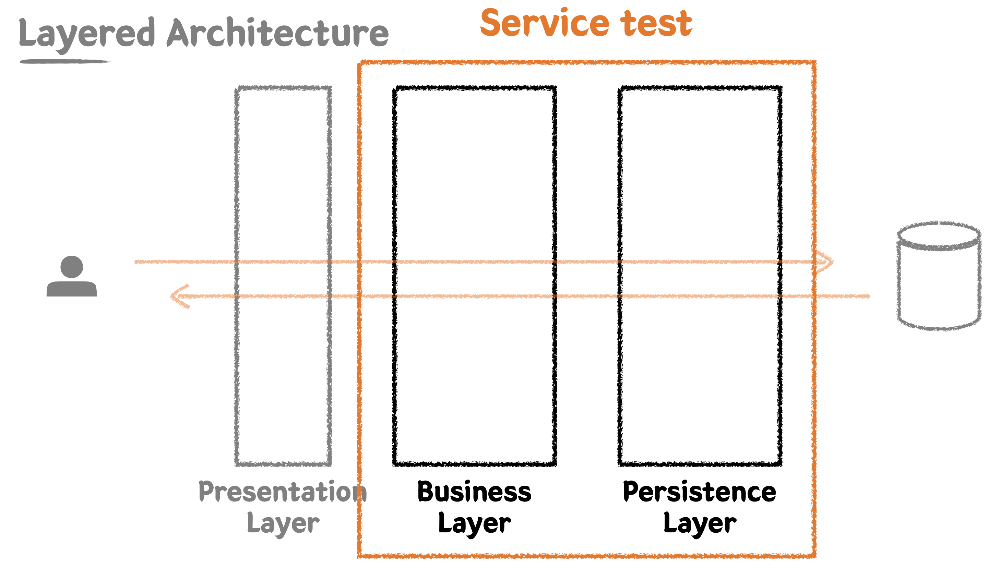

### Layered Architecture와 테스트

스프링 MVC 등의 프레임워크에서는 주로 Layered Architecture를 사용하여 웹 어플리케이션을 구성한다.  
크게 Presentation Layer, Business Layer, Persistence Layer로 계층을 나누게 된다.  
이와 같이 계층을 구분하는 가장 큰 목적은, 관심사의 분리에 있다.  
역할과 책임을 중심으로 계층을 나눠서, 애플리케이션을 쉽게 유지보수할 수 있도록 하는 것이다.

이 때 각 계층에 스프링 MVC와 JPA 등의 기술들이 개입하면서, 이들이 테스트하기 어렵게 느껴질 수 있다.  
하지만 테스트의 기본 원리는 기술이 개입된다고 해도 변하지 않는다.  
테스트 불가능한 부분을 분리해내서 테스트 가능한 부분에 집중하고, 문서로써의 테스트를 깔끔하게 작성하면 된다.  
다만 테스트 대상이 Spring + JPA로 구성된 웹 어플리케이션으로 변경되었으므로, 해당 환경에서 무엇을, 어떻게 테스트해야 하는지에 대해서 추가로 확인하면 된다.

지금까지 우리는 특정 클래스, 메서드를 대상으로 하는 단위 테스트 위주로 테스트 코드를 작성해 왔다.  
하지만 이렇게 각각의 개체들을 테스트 하는 것만으로는, 이들이 함께 협력하여 동작하는 상황에서도 예상과 같이 동작할 것이라고 장담할 수 없다.

**통합 테스트**는 여러 모듈이 협력하는 기능을 통합적으로 검증하는 테스트이다.  
작은 범위의 단위 테스트를 넘어, 기능 전체를 통합적으로 검증함으로써 기능을 신뢰할 수 있게 한다.  
보통 각 모듈에 대해서 풍부하게 단위 테스트를 작성하고, 큰 기능들에 대해서 통합 테스트를 작성하는 식으로 전체 테스트가 구성된다.

### 스프링 & JPA 훑어보기

#### 1. 스프링

먼저 라이브러리와 프레임워크의 차이에 대해서 살펴보자.  
라이브러리를 사용하는 상황에서는 내가 작성한 코드가 능동적인 주체가 된다.  
내 코드에서 외부의 라이브러리를 가져와서 사용하게 된다.  
이와 달리 프레임워크는 내가 작성한 코드가 수동적인 대상이 된다.  
이미 동작하고 있는 시스템 내에 나의 코드를 삽입하여 동작하게 만드는 식으로 프로젝트를 구현한다.

스프링은 프레임워크로써 제공되기 때문에, 스프링을 사용하면 스프링이 갖춰놓은 기술과 환경을 사용하게 된다.  
스프링의 기술들은 IoC(Inversion of Control), DI(Dependency Injection), AOP(Aspect Oriented Programming) 을 기반으로 하고 있다.

IoC는 제어의 역전이라는 의미이다.  
전통적인 방식에서는 A 객체와 B 객체가 협력하는 상황이라면, A 객체 내부에서 B 객체를 생성해서 사용해야 한다.  
하지만 이 경우 A 객체와 B 객체가 강결합 되는 문제가 발생한다.  
이러한 문제가 있으므로 객체를 생성하고 관리하는 제어 권한을 객체 내부가 아닌 외부에서 가져야 한다는 것이 IoC이다.  
이를 위해 외부에서 객체를 생성하여 주입하는 의존성 주입(DI)을 사용한다.  
이를 통해 각 객체는 인터페이스에만 의존하게 되어, 객체 간의 결합도를 낮출 수 있다.

AOP는 비즈니스 로직과 무관한 코드들을 관점(Aspect)로 분리한다.  
대표적으로 트랜잭션, 로깅을 위한 세팅 작업들을 관점이라고 할 수 있다.  
이들을 각각 모아서 모듈로 만들고 분리해내서, 코드에서는 비즈니스 로직에만 집중할 수 있게 한다.

#### 2. JPA

객체 지향적인 개발 방식과 관계형 데이터베이스를 다루는 방식은 그 사이의 간극이 매우 큰 편이다.  
개발 단계에서 아무리 객체의 협력을 중심으로 잘 개발을 했더라도, 데이터를 저장할 때에는 그것을 하나하나 다시 분리해서 db의 테이블 및 칼럼에 맞춰서 저장해야 하는 문제가 있었다.  
ORM은 이 사이의 간극을 매꿔서, 객체 지향적인 개발 방식을 그대로 유지하면서도 데이터를 RDB에 저장할 수 있도록 지원해주는 기술이다.

JPA는 이러한 ORM 기술을 자바 표준으로 정의한 것이며, 그 구현체로 Hibernate를 많이 사용한다.  
JPA를 사용하면 반복적인 CRUD 쿼리 작업의 상당 부분이 자동으로 처리된다.

#### 엔티티 정의

수업에서는 Order와 Product를 다대다 관계로 구성할 것이다.  
이 때 중간 테이블로 OrderProduct를 사용하여, 일대다 + 다대일 관계로 풀어낼 것이다.

### 프로젝트 구현

이전에 정의했던 요구 사항을 보다 확장해서 정의해보자.  
고객은 주문이 가능한 상품 리스트를 조회할 수 있어야 한다.  
이 때 각 음료들은 판매 중, 판매 보류, 판매 중지 상태를 가져야 한다.  
고객들에게는 판매 중이거나 판매 보류 중인 음료 목록을 보여줄 것이다.  
반환 받는 데이터에는 다음의 정보가 포함되어야 한다.  
`id, 상품 번호, 상품 타입, 판매 상태, 상품 이름, 가격`

먼저 상품 타입과 판매 상태에 대한 enum을 각각 정의한다.  
이 때 판매 상태 enum 내에는 사용자에게 보여줄 판매 상태 목록을 배열로 반환하는 메서드를 정의한다.

```java
package sample.cafekiosk.spring.domain.product;

@Getter
@RequiredArgsConstructor
public enum ProductType {
    HANDMADE("제조 음료"),
    BOTTLE("병 음료"),
    BAKERY("베이커리");

    private final String text;
}
```

```java
package sample.cafekiosk.spring.domain.product;

@Getter
@RequiredArgsConstructor
public enum ProductSellingStatus {
    SELLING("판매중"),
    HOLD("판매보류"),
    STOP_SELLING("판매중지");

    private final String text;

    public static List<ProductSellingStatus> forDisplay() {
        return List.of(SELLING, HOLD);
    }
}
```

또한 생성일, 수정일 과 같은 공통 정보를 담고 있는 추상 클래스를 정의하고, 상속해서 사용하자.

```java
package sample.cafekiosk.spring.domain;

@Getter
@MappedSuperclass
@EntityListeners(AuditingEntityListener.class)
public abstract class BaseEntity {
    @CreatedDate
    private LocalDateTime createdDateTime;

    @LastModifiedDate
    private LocalDateTime modifiedDateTime;
}
```

> 자동으로 생성일, 수정일 정보를 받아오게 하기 위해 스프링 어플리케이션에 ‎@EnableJpaAuditing을 붙여야 한다.

이제 데이터 CRUD를 수행할 레포지토리를 정의한다.  
예제에서는 스프링 데이터 JPA를 사용한다.  
요구사항을 만족하기 위해서 판매 상태에 따라 상품 목록을 조회하는 메서드를 정의한다.  
스프링 데이터 JPA의 쿼리 메서드 기능을 이용하여 정의한다.

```java
package sample.cafekiosk.spring.domain.product;

@Repository
public interface ProductRepository extends JpaRepository<Product, Long> {
    /**
     * select *
     * from product
     * where selling_status in ('SELLING', 'HOLD');
     */
    List<Product> findAllBySellingStatusIn(List<ProductSellingStatus> sellingStatuses);
}
```

이제 서비스 계층을 정의할 차례이다.  
서비스 단에서는 적절하게 상품 목록을 불러와서, DTO로 적절히 변환하여 반환하도록 구현할 것이다.  
이를 위해 먼저 DTO 객체를 정의한다.

```java
package sample.cafekiosk.spring.api.service.product.response;

@Getter
public class ProductResponse {
    private Long id;
    private String productNumber;
    private ProductType type;
    private ProductSellingStatus sellingStatus;
    private String name;
    private int price;

    @Builder
    private ProductResponse(Long id, String productNumber, ProductType type, ProductSellingStatus sellingStatus, String name, int price) {
        this.id = id;
        this.productNumber = productNumber;
        this.type = type;
        this.sellingStatus = sellingStatus;
        this.name = name;
        this.price = price;
    }

    public static ProductResponse of(Product product) {
        return ProductResponse.builder()
                .id(product.getId())
                .productNumber(product.getProductNumber())
                .type(product.getType())
                .sellingStatus(product.getSellingStatus())
                .name(product.getName())
                .price(product.getPrice())
                .build();
    }
}
```

이제 다음과 같이 서비스 계층을 정의할 수 있다.  
레포지토리 계층에 대한 요청을 통해 데이터를 받아오고, 적절히 dto로 변환하여 반환한다.

```java
package sample.cafekiosk.spring.api.service.product;

@RequiredArgsConstructor
@Service
public class ProductService {

    private final ProductRepository productRepository;

    public List<ProductResponse> getSellingProducts() {
        List<Product> products = productRepository.findAllBySellingStatusIn(ProductSellingStatus.forDisplay());

        return products.stream()
                .map(ProductResponse::of)
                .collect(Collectors.toList());
    }
}
```

마지막으로 컨트롤러 객체를 다음과 같이 정의하면 요구사항을 반영한 구현이 1차적으로 끝나게 된다.

```java
package sample.cafekiosk.spring.api.controller.product;

@RequiredArgsConstructor
@RestController
public class ProductController {
    private final ProductService productService;

    @GetMapping("/api/v1/products/selling")
    public List<ProductResponse> getSellingProducts() {
        return productService.getSellingProducts();
    }
}
```

이제 앱을 실행하기 위한 설정을 진행하면 된다.  
local, test 프로파일을 각각 정의한다.

application.yml 설정 시 ddl-auto에 데이터를 초기회하는지 여부를 세팅하는데, 각 프로파일 별로 신경 써서 작성해야 한다.  
defer-datasource-initialization 설정을 통해서는 data.sql이 실행되는 타이밍을 설정할 수 있다.  
기본값인 false는 Hibernate 세팅 전에 실행하는 것이고, true로 지정하면 ddl을 통한 테이블 생성이 끝난 후에 data.sql을 실행한다.  
테스트 환경에서는 직접 given에서 필요한 데이터를 삽입할 것이기 때문에 `sql: init: mode: never`로 설정했다.

```yaml
spring:
  profiles:
    default: local

  datasource:
    url: jdbc:h2:mem:~/cafeKioskApplication
    driver-class-name: org.h2.Driver
    username: sa
    password:

  jpa:
    hibernate:
      ddl-auto: none
---
spring:
  config:
    activate:
      on-profile: local

  jpa:
    hibernate:
      ddl-auto: create
    show-sql: true
    properties:
      hibernate:
        format_sql: true
    defer-datasource-initialization: true # (2.5~) Hibernate 초기화 이후 data.sql 실행

  h2:
    console:
      enabled: true
---
spring:
  config:
    activate:
      on-profile: test

  jpa:
    hibernate:
      ddl-auto: create
    show-sql: true
    properties:
      hibernate:
        format_sql: true

  sql:
    init:
      mode: never
```

기본 데이터를 삽입하기 위한 data.sql은 resources 하위에 작성한다.

```sql
insert into product(product_number, type, selling_status, name, price)
values ('001', 'HANDMADE', 'SELLING', '아메리카노', 4000),
       ('002', 'HANDMADE', 'HOLD', '카페라떼', 4500),
       ('003', 'BAKERY', 'STOP_SELLING', '크루아상', 3500);
```

### Persistence Layer 테스트

이제 영속성 계층에 대한 테스트를 작성해보자.  
다만 스프링 데이터 JPA 레포지토리의 쿼리 메서드를 이용하여 간단하게 조회 메서드를 구현한 상태에서, 굳이 테스트가 필요한지 의문일 수 있다.  
하지만 레포지토리 단의 메서드도 우리가 작성한 코드의 일부이기 때문에 검증이 필요하다.  
특히 where 조건이 늘어나는 등 메서드가 복잡해지면 의도한 대로 쿼리가 발생하지 않을 수 있다.  
또한 QueryDsl, MyBatis 등 다른 기술을 사용하는 것으로 변경될 수도 있기 때문에, 이런 상황에서도 코드의 정상 동작을 보장하기 위해서는 테스트 코드가 필요하다.

레포지토리에 대한 테스트에서는 실제로 스프링 앱을 띄워서 의존성 주입을 마쳐야 한다.  
이를 위해 @SpringBootTest, 또는 데이터 JPA 사용을 위한 빈들을 등록해주는 @DataJpaTest를 테스트 클래스에 붙여야 한다.  
따라서 기본적으로는 통합 테스트이지만, 데이터 저장소를 다루는 일부의 기능만을 확인하기 때문에 통합 테스트로써의 성격도 가진다.

전체 테스트 코드는 다음과 같다.  
테스트 프로파일을 사용하기 위해 @ActiveProfiles("test")을 테스트 클래스에 붙였다.  
테스트 케이스의 given에서는 세 개의 Product 객체를 생성하고, 이를 레포지토리에 저장한다.  
when에서 레포지토리의 조회 메서드를 실행하고, then에서 적절히 아이템이 조회 되었는지를 테스트한다.  
이 때 리스트를 검증할 때에는 먼저 리스트의 사이즈를 체크하고, extracting을 통해 각 객체에서 일부의 필드만을 추출한 후, containsExactlyInAnyOrder를 통해 tuple을 이용하여 각 데이터의 값을 검증한다.

```java
package sample.cafekiosk.spring.domain.product;

@ActiveProfiles("test")
//@SpringBootTest
@DataJpaTest
class ProductRepositoryTest {

    @Autowired
    private ProductRepository productRepository;

    @DisplayName("원하는 판매상태를 가진 상품들을 조회한다.")
    @Test
    void findAllBySellingStatusIn() {
        // given
        Product product1 = Product.builder()
                .productNumber("001")
                .type(HANDMADE)
                .sellingStatus(SELLING)
                .name("아메리카노")
                .price(4000)
                .build();
        Product product2 = Product.builder()
                .productNumber("002")
                .type(HANDMADE)
                .sellingStatus(HOLD)
                .name("카페라떼")
                .price(4500)
                .build();
        Product product3 = Product.builder()
                .productNumber("003")
                .type(HANDMADE)
                .sellingStatus(STOP_SELLING)
                .name("팥빙수")
                .price(7000)
                .build();
        productRepository.saveAll(List.of(product1, product2, product3));

        // when
        List<Product> products = productRepository.findAllBySellingStatusIn(List.of(SELLING, HOLD));

        // then
        assertThat(products).hasSize(2)
                .extracting("productNumber", "name", "sellingStatus")
                .containsExactlyInAnyOrder(
                        tuple("001", "아메리카노", SELLING),
                        tuple("002", "카페라떼", HOLD)
                );
    }

}
```

### Business Layer 테스트

Persistence Layer는 데이터 접근을 맡는 계층이다.  
해당 계층에는 비즈니스 로직이 개입되지 않아야 하고, 순수하게 데이터 CRUD에만 집중해야 한다.  
테스트도 이에 맞게 데이터 접근 자체에 대해서만 집중해야 한다.

Business Layer는 비즈니스 로직을 구현하는 계층이다.  
Persistence Layer를 통해 데이터를 읽고 쓰면서 비즈니스 로직을 전개해나가게 된다.  
또한 비즈니스 로직 단위로 작업의 원자성을 보장해야 하기 때문에, Business Layer 단에서 트랜잭션으로 작업을 묶어야 한다.

Business Layer에 대한 테스트를 작성할 때에는 Persistence Layer를 함께 묶어서 작성할 것이다.  
이를 통해 통합 테스트로 구성하여, 전체 객체가 의도한 대로 협력하여 동작하는지를 검증할 것이다.



먼저 새로운 요구사항을 추가해보자.  
이번엔 상품 번호 목록을 받아서 주문을 생성하는 기능을 구현해야 한다.  
주문은 주문 상태, 주문 등록 시간 정보를 가져야 하고, 주문의 총 금액 시간을 계산 가능해야 한다.

먼저 각각의 주문 상태를 나타내는 enum을 정의한다.

```java
package sample.cafekiosk.spring.domain.order;

@Getter
@RequiredArgsConstructor
public enum OrderStatus {

    INIT("주문생성"),
    CANCELED("주문취소"),
    PAYMENT_COMPLETED("결제완료"),
    PAYMENT_FAILED("결제실패"),
    RECEIVED("주문접수"),
    COMPLETED("처리완료");

    private final String text;

}
```

이제 Order와 Product 간 다대다 관계를 구성하기 위해, 중간 테이블 엔티티를 정의한다.  
중간 엔티티는 내부에 Order와 Product에 대한 참조를 가지고, @ManyToOne 설정이 되어있어야 한다.

```java
package sample.cafekiosk.spring.domain.orderproduct;

@Getter
@NoArgsConstructor(access = AccessLevel.PROTECTED)
@Entity
public class OrderProduct extends BaseEntity {

    @Id
    @GeneratedValue(strategy = GenerationType.IDENTITY)
    private Long id;

    @ManyToOne(fetch = FetchType.LAZY)
    private Order order;

    @ManyToOne(fetch = FetchType.LAZY)
    private Product product;

    public OrderProduct(Order order, Product product) {
        this.order = order;
        this.product = product;
    }

}
```

이제 Order 엔티티를 정의한다.  
Order에서는 자신에게 담긴 상품의 목록에 접근해야 하는 경우가 많다.  
따라서 Order와 OrderProduct가 양방향 관계를 가지도록 하기 위해, 내부에 OrderProduct 목록을 가지게 한다.

```java
package sample.cafekiosk.spring.domain.order;

@Getter
@NoArgsConstructor(access = AccessLevel.PROTECTED)
@Table(name = "orders")
@Entity
public class Order extends BaseEntity {

    @Id
    @GeneratedValue(strategy = GenerationType.IDENTITY)
    private Long id;

    @Enumerated(EnumType.STRING)
    private OrderStatus orderStatus;

    private int totalPrice;

    private LocalDateTime registeredDateTime;

    @OneToMany(mappedBy = "order", cascade = CascadeType.ALL)
    private List<OrderProduct> orderProducts = new ArrayList<>();

}
```

이제 주문에 대한 요청을 받는 OrderController를 구현한다.  
주문 생성 요청에 대한 request body 클래스를 정의하고, 컨트롤러에서는 이를 받아서 Service 계층에 주문 생성 요청을 하도록 구현한다.

```java
package sample.cafekiosk.spring.api.controller.order.request;

@Getter
public class OrderCreateRequest {

    private List<String> productNumbers;

    @Builder
    private OrderCreateRequest(List<String> productNumbers) {
        this.productNumbers = productNumbers;
    }

}
```

```java
package sample.cafekiosk.spring.api.controller.order;

@RequiredArgsConstructor
@RestController
public class OrderController {

    private final OrderService orderService;

    @PostMapping("/api/v1/orders/new")
    public void createOrder(@RequestBody OrderCreateRequest request) {
        LocalDateTime registeredDateTime = LocalDateTime.now();
        orderService.createOrder(request, registeredDateTime);
    }

}
```

이제 본격적으로 TDD 방식을 통해 서비스 계층을 구현해보자.  
먼저 다음과 같이 createOrder에 대한 테스트 코드를 작성한다.  
given에서는 주문에 넣을 각각의 Product 객체를 생성하고 레포지토리에 저장해야 한다.  
이 때 각 Product를 builder로 생성하기에는 지나치게 코드가 길어지므로, 도우미 메서드인 createProduct를 정의해서 사용한다.  
Product들을 저장한 후에는, 해당 상품들의 상품번호를 이용하여 OrderCreateRequest 객체를 생성한다.  
when에서는 주문 생성 메서드를 실행하고, then에서는 주문이 정상적으로 생성되었는지를 검증한다.

```java
package sample.cafekiosk.spring.api.service.order;

@ActiveProfiles("test")
@SpringBootTest
class OrderServiceTest {

    @Autowired
    private ProductRepository productRepository;

    @Autowired
    private OrderService orderService;

    @DisplayName("주문번호 리스트를 받아 주문을 생성한다.")
    @Test
    void createOrder() {
        // given
        LocalDateTime registeredDateTime = LocalDateTime.now();

        Product product1 = createProduct(HANDMADE, "001", 1000);
        Product product2 = createProduct(HANDMADE, "002", 3000);
        Product product3 = createProduct(HANDMADE, "003", 5000);
        productRepository.saveAll(List.of(product1, product2, product3));

        OrderCreateRequest request = OrderCreateRequest.builder()
                .productNumbers(List.of("001", "002"))
                .build();

        // when
        OrderResponse orderResponse = orderService.createOrder(request, registeredDateTime);

        // then
        assertThat(orderResponse.getId()).isNotNull();
        assertThat(orderResponse)
                .extracting("registeredDateTime", "totalPrice")
                .contains(registeredDateTime, 4000);
        assertThat(orderResponse.getProducts()).hasSize(2)
                .extracting("productNumber", "price")
                .containsExactlyInAnyOrder(
                        tuple("001", 1000),
                        tuple("002", 3000)
                );
    }

    private Product createProduct(ProductType type, String productNumber, int price) {
        return Product.builder()
                .type(type)
                .productNumber(productNumber)
                .price(price)
                .sellingStatus(SELLING)
                .name("메뉴 이름")
                .build();
    }
}
```

이 때 OrderResponse는 다음과 같이 정의한다.  
Order의 일부 프로퍼티들을 가지고 있고, 상품 목록의 경우 ProductResponse 타입으로 가지고 있다.

```java
package sample.cafekiosk.spring.api.service.order.response;

@Getter
public class OrderResponse {

    private Long id;
    private int totalPrice;
    private LocalDateTime registeredDateTime;
    private List<ProductResponse> products;

    @Builder
    private OrderResponse(Long id, int totalPrice, LocalDateTime registeredDateTime, List<ProductResponse> products) {
        this.id = id;
        this.totalPrice = totalPrice;
        this.registeredDateTime = registeredDateTime;
        this.products = products;
    }

    public static OrderResponse of(Order order) {
        return OrderResponse.builder()
                .id(order.getId())
                .totalPrice(order.getTotalPrice())
                .registeredDateTime(order.getRegisteredDateTime())
                .products(order.getOrderProducts().stream()
                        .map(orderProduct -> ProductResponse.of(orderProduct.getProduct()))
                        .collect(Collectors.toList())
                )
                .build();
    }
}
```

이제 최종적으로 OrderService를 구현해보자.

```java
package sample.cafekiosk.spring.api.service.order;

@RequiredArgsConstructor
@Service
public class OrderService {

    private final ProductRepository productRepository;
    private final OrderRepository orderRepository;

    public OrderResponse createOrder(OrderCreateRequest request, LocalDateTime registeredDateTime) {
        List<String> productNumbers = request.getProductNumbers();
        List<Product> products = productRepository.findAllByProductNumberIn(productNumbers);

        Order order = Order.create(products, registeredDateTime);
        Order savedOrder = orderRepository.save(order);
        return OrderResponse.of(savedOrder);
    }

}
```

서비스 계층을 구현하는 과정에서 product number를 바탕으로 Product 목록을 조회하는 레포지토리 계층의 메서드가 필요함이 확인되었다.  
이를 위해 다음과 같이 레포지토리에 메서드를 추가하고, 테스트를 작성한다.

```java
package sample.cafekiosk.spring.domain.product;

@Repository
public interface ProductRepository extends JpaRepository<Product, Long> {
    ...
    List<Product> findAllByProductNumberIn(List<String> productNumbers);
}
```

```java
package sample.cafekiosk.spring.domain.product;

@ActiveProfiles("test")
//@SpringBootTest
@DataJpaTest
class ProductRepositoryTest {

    @Autowired
    private ProductRepository productRepository;

    ...

    @DisplayName("상품번호 리스트로 상품들을 조회한다.")
    @Test
    void findAllByProductNumberIn() {
        // given
        Product product1 = Product.builder()
                .productNumber("001")
                .type(HANDMADE)
                .sellingStatus(SELLING)
                .name("아메리카노")
                .price(4000)
                .build();
        Product product2 = Product.builder()
                .productNumber("002")
                .type(HANDMADE)
                .sellingStatus(HOLD)
                .name("카페라떼")
                .price(4500)
                .build();
        Product product3 = Product.builder()
                .productNumber("003")
                .type(HANDMADE)
                .sellingStatus(STOP_SELLING)
                .name("팥빙수")
                .price(7000)
                .build();
        productRepository.saveAll(List.of(product1, product2, product3));

        // when
        List<Product> products = productRepository.findAllByProductNumberIn(List.of("001", "002"));

        // then
        assertThat(products).hasSize(2)
                .extracting("productNumber", "name", "sellingStatus")
                .containsExactlyInAnyOrder(
                        tuple("001", "아메리카노", SELLING),
                        tuple("002", "카페라떼", HOLD)
                );
    }
}
```

또한 product 리스트를 바탕으로 Order를 생성하는 메서드도 구현이 필요해졌다.  
생성일의 경우 LocalDateTime.now()를 내부적으로 사용하게 되면 테스트가 어려워지기 때문에, 이를 외부에 분리하기 위해 매개변수로 생성일을 받는 식으로 메서드를 구성해야 한다.

```java
package sample.cafekiosk.spring.domain.order;

@Getter
@NoArgsConstructor(access = AccessLevel.PROTECTED)
@Table(name = "orders")
@Entity
public class Order extends BaseEntity {

    @Id
    @GeneratedValue(strategy = GenerationType.IDENTITY)
    private Long id;

    @Enumerated(EnumType.STRING)
    private OrderStatus orderStatus;

    private int totalPrice;

    private LocalDateTime registeredDateTime;

    @OneToMany(mappedBy = "order", cascade = CascadeType.ALL)
    private List<OrderProduct> orderProducts = new ArrayList<>();

    public Order(List<Product> products, LocalDateTime registeredDateTime) {
        this.orderStatus = OrderStatus.INIT;
        this.totalPrice = calculateTotalPrice(products);
        this.registeredDateTime = registeredDateTime;
        this.orderProducts = products.stream()
                .map(product -> new OrderProduct(this, product))
                .collect(Collectors.toList());
    }

    public static Order create(List<Product> products, LocalDateTime registeredDateTime) {
        return new Order(products, registeredDateTime);
    }

    private int calculateTotalPrice(List<Product> products) {
        return products.stream()
                .mapToInt(Product::getPrice)
                .sum();
    }

}
```

이와 같이 Order의 팩터리 메서드에는 기본 orderStatus를 설정하고, 총 가격을 계산하고, 날짜를 받아서 저장하는 등의 로직이 들어가기 때문에, 이에 대해서도 단위 테스트가 필요하다.  
각 부분들에 대한 테스트 코드를 다음과 같이 작성한다.

```java
package sample.cafekiosk.spring.domain.order;

class OrderTest {

    @DisplayName("주문 생성 시 상품 리스트에서 주문의 총 금액을 계산한다.")
    @Test
    void calculateTotalPrice() {
        // given
        List<Product> products = List.of(
                createProduct("001", 1000),
                createProduct("002", 2000)
        );

        // when
        Order order = Order.create(products, LocalDateTime.now());

        // then
        assertThat(order.getTotalPrice()).isEqualTo(3000);
    }

    @DisplayName("주문 생성 시 주문 상태는 INIT이다.")
    @Test
    void init() {
        // given
        List<Product> products = List.of(
                createProduct("001", 1000),
                createProduct("002", 2000)
        );

        // when
        Order order = Order.create(products, LocalDateTime.now());

        // then
        assertThat(order.getOrderStatus()).isEqualByComparingTo(OrderStatus.INIT);
    }

    @DisplayName("주문 생성 시 주문 등록 시간을 기록한다.")
    @Test
    void registeredDateTime() {
        // given
        LocalDateTime registeredDateTime = LocalDateTime.now();
        List<Product> products = List.of(
                createProduct("001", 1000),
                createProduct("002", 2000)
        );

        // when
        Order order = Order.create(products, registeredDateTime);

        // then
        assertThat(order.getRegisteredDateTime()).isEqualTo(registeredDateTime);
    }

    private Product createProduct(String productNumber, int price) {
        return Product.builder()
                .type(HANDMADE)
                .productNumber(productNumber)
                .price(price)
                .sellingStatus(SELLING)
                .name("메뉴 이름")
                .build();
    }

}
```

Order에 대한 Repository는 다음과 같이 간단하게 구현한다.

```java
package sample.cafekiosk.spring.domain.order;

@Repository
public interface OrderRepository extends JpaRepository<Order, Long> {
}
```
