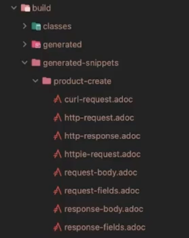

### 학습 테스트

학습 테스트는 잘 모르는 기능, 라이브러리, 프레임워크를 이해하기 위해 작성하는 테스트이다.  
여러 테스트 케이스를 스스로 정의하고 검증함으로써 구체적인 동작과 기능을 학습할 수 있다.

예를 들어 구글에서 제공하는 자바 관련 라이브러리인 guava에 대해서 학습한다고 하자.  
먼저 다음과 같이 의존성을 추가한다.

```
implementation("com.google.guava:guava:31.1-jre")
```

이제 guava의 Lists.partition과 Multimap 기능을 학습하면서 다음의 테스트 코드를 작성할 수 있다.  
여러 시나리오를 점검하면서 guava의 기능을 학습할 수 있다.

```java
package sample.cafekiosk.learning;

class GuavaLearningTest {

    @DisplayName("주어진 개수만큼 List를 파티셔닝한다.")
    @Test
    void partitionLearningTest1() {
        // given
        List<Integer> integers = List.of(1, 2, 3, 4, 5, 6);

        // when
        List<List<Integer>> partition = Lists.partition(integers, 3);

        // then
        assertThat(partition).hasSize(2)
            .isEqualTo(List.of(
                List.of(1, 2, 3), List.of(4, 5, 6)
            ));
    }

    @DisplayName("주어진 개수만큼 List를 파티셔닝한다.")
    @Test
    void partitionLearningTest2() {
        // given
        List<Integer> integers = List.of(1, 2, 3, 4, 5, 6);

        // when
        List<List<Integer>> partition = Lists.partition(integers, 4);

        // then
        assertThat(partition).hasSize(2)
            .isEqualTo(List.of(
                List.of(1, 2, 3, 4), List.of(5, 6)
            ));
    }

    @DisplayName("멀티맵 기능 확인")
    @Test
    void multiMapLearningTest() {
        // given
        Multimap<String, String> multimap = ArrayListMultimap.create();
        multimap.put("커피", "아메리카노");
        multimap.put("커피", "카페라떼");
        multimap.put("커피", "카푸치노");
        multimap.put("베이커리", "크루아상");
        multimap.put("베이커리", "식빵");

        // when
        Collection<String> strings = multimap.get("커피");

        // then
        assertThat(strings).hasSize(3)
            .isEqualTo(List.of("아메리카노", "카페라떼", "카푸치노"));
    }

    @DisplayName("멀티맵 기능 확인")
    @TestFactory
    Collection<DynamicTest> multiMapLearningTest2() {
        // given
        Multimap<String, String> multimap = ArrayListMultimap.create();
        multimap.put("커피", "아메리카노");
        multimap.put("커피", "카페라떼");
        multimap.put("커피", "카푸치노");
        multimap.put("베이커리", "크루아상");
        multimap.put("베이커리", "식빵");

        return List.of(
            DynamicTest.dynamicTest("1개 value 삭제", () -> {
                // when
                multimap.remove("커피", "카푸치노");

                // then
                Collection<String> results = multimap.get("커피");
                assertThat(results).hasSize(2)
                    .isEqualTo(List.of("아메리카노", "카페라떼"));
            }),
            DynamicTest.dynamicTest("1개 key 삭제", () -> {
                // when
                multimap.removeAll("커피");

                // then
                Collection<String> results = multimap.get("커피");
                assertThat(results).isEmpty();
            })
        );
    }

}
```

만약 관련 내용이 팀원들에게도 공유할만 하다면, DisplayName을 다듬어서 공유할 수도 있을 것이다.

### Spring REST Docs

Spring REST Docs는 테스트 코드를 통한 API 문서화를 자동화하는 도구이다.  
기본적으로 AsciiDoc을 사용하여 문서를 작성한다.

대표적인 API 문서화 도구에는 REST Docs와 Swagger가 있다.  
먼저 REST Docs는 테스트를 통과해야 문서가 만들어지는 식으로 동작하기 때문에, 문서의 신뢰도가 높은 편이다.  
또한 프로덕션 코드에 침투되지 않는다는 점도 장점이다.  
하지만 코드 양이 많은 편이고, 설정이 까다롭다는 단점이 있다.

Swagger는 간단한 설정 만으로 적용이 가능하고, 문서에서 바로 API 호출을 해볼 수 있으며, 좀 더 보기 좋게 문서를 만들어준다는 장점이 있다.  
하지만 프로덕션 코드에 침투적이고, 테스트 코드와 무관하기 때문에 문서의 신뢰도가 떨어질 수 있다는 단점이 있다.

이제 다음과 같이 build.gradle에 설정들을 추가해야 한다.  
먼저 플러그인과 의존성을 추가하고, 테스트를 수행하여 문서를 생성하는 태스크들을 정의한다.

```groovy
plugins {
    ...
    id "org.asciidoctor.jvm.convert" version "3.3.2"
}

configurations {
    ...
    asciidoctorExt
}

dependencies {
    ...

    // RestDocs
    asciidoctorExt 'org.springframework.restdocs:spring-restdocs-asciidoctor'
    testImplementation 'org.springframework.restdocs:spring-restdocs-mockmvc'
}

ext { // 전역 변수
    snippetsDir = file('build/generated-snippets')
}

test {
    outputs.dir snippetsDir
}

asciidoctor {
    inputs.dir snippetsDir
    configurations 'asciidoctorExt'

    sources { // 특정 파일만 html로 만든다.
        include("**/index.adoc")
    }
    baseDirFollowsSourceFile() // 다른 adoc 파일을 include 할 때 경로를 baseDir로 맞춘다.
    dependsOn test
}

bootJar {
    dependsOn asciidoctor
    from("${asciidoctor.outputDir}") {
        into 'static/docs'
    }
}
```

ext에서는 snippetsDir 이라는 전역변수로 테스트 결과 문서 조각들을 저장할 디렉토리를 저장한다.  
이제 test에서는 전체 테스트를 수행하면서 snippetsDir에 결과 문서들을 저장한다.  
asciidoctor에서는 snippetsDir의 문서들을 asciidoctorExt에 있는 의존성을 사용하여 html로 변환한다.  
최종적으로 bootJar는 html로 된 문서들을 jar 파일에 포함시킨다.

이제 REST Docs를 위한 환경을 세팅하는 추상 클래스를 구현한다.  
MockMvcBuilders.standaloneSetup을 통해 mockMvc를 구성하면 스프링 어플리케이션을 띄우지 않고도 테스트를 실행할 수 있다.  
이 때 initController 추상 메서드를 정의해서 mockMvc에 적용할 컨트롤러를 넘기도록 구현할 것이다.

```java
package sample.cafekiosk.spring.docs;

@ExtendWith(RestDocumentationExtension.class)
public abstract class RestDocsSupport {

    protected MockMvc mockMvc;
    protected ObjectMapper objectMapper = new ObjectMapper();

    @BeforeEach
    void setUp(RestDocumentationContextProvider provider) {
        this.mockMvc = MockMvcBuilders.standaloneSetup(initController())
            .apply(documentationConfiguration(provider))
            .build();
    }

    protected abstract Object initController();

}
```

이제 다음과 같이 RestDocsSupport를 상속받아 테스트 코드를 작성한다.  
먼저 ProductService를 모킹한 객체를 생성해두고, initController에서는 이를 이용하여 ProductController를 생성하여 반환한다.  
각 API에 대한 테스트는 기존과 동일하게 작성하되, 마지막으로 .andDo 절에서 문서 작성 구문을 추가한다.  
requestFields를 통해 request body의 각 프로퍼티에 대한 설명을 명시하고, responseFields에는 response body에 대한 설명을 명시한다.  
preprocess에는 prettyPrint를 추가하여, 응답 json을 보기 좋게 출력하도록 설정한다.

```java
package sample.cafekiosk.spring.docs.product;

public class ProductControllerDocsTest extends RestDocsSupport {

    private final ProductService productService = mock(ProductService.class);

    @Override
    protected Object initController() {
        return new ProductController(productService);
    }

    @DisplayName("신규 상품을 등록하는 API")
    @Test
    void createProduct() throws Exception {
        ProductCreateRequest request = ProductCreateRequest.builder()
            .type(ProductType.HANDMADE)
            .sellingStatus(ProductSellingStatus.SELLING)
            .name("아메리카노")
            .price(4000)
            .build();

        given(productService.createProduct(any(ProductCreateServiceRequest.class)))
            .willReturn(ProductResponse.builder()
                .id(1L)
                .productNumber("001")
                .type(ProductType.HANDMADE)
                .sellingStatus(ProductSellingStatus.SELLING)
                .name("아메리카노")
                .price(4000)
                .build()
            );

        mockMvc.perform(
                post("/api/v1/products/new")
                    .content(objectMapper.writeValueAsString(request))
                    .contentType(MediaType.APPLICATION_JSON)
            )
            .andDo(print())
            .andExpect(status().isOk())
            .andDo(document("product-create",
                preprocessRequest(prettyPrint()),
                preprocessResponse(prettyPrint()),
                requestFields(
                    fieldWithPath("type").type(JsonFieldType.STRING)
                        .description("상품 타입"),
                    fieldWithPath("sellingStatus").type(JsonFieldType.STRING)
                        .optional()
                        .description("상품 판매상태"),
                    fieldWithPath("name").type(JsonFieldType.STRING)
                        .description("상품 이름"),
                    fieldWithPath("price").type(JsonFieldType.NUMBER)
                        .description("상품 가격")
                ),
                responseFields(
                    fieldWithPath("code").type(JsonFieldType.NUMBER)
                        .description("코드"),
                    fieldWithPath("status").type(JsonFieldType.STRING)
                        .description("상태"),
                    fieldWithPath("message").type(JsonFieldType.STRING)
                        .description("메시지"),
                    fieldWithPath("data").type(JsonFieldType.OBJECT)
                        .description("응답 데이터"),
                    fieldWithPath("data.id").type(JsonFieldType.NUMBER)
                        .description("상품 ID"),
                    fieldWithPath("data.productNumber").type(JsonFieldType.STRING)
                        .description("상품 번호"),
                    fieldWithPath("data.type").type(JsonFieldType.STRING)
                        .description("상품 타입"),
                    fieldWithPath("data.sellingStatus").type(JsonFieldType.STRING)
                        .description("상품 판매상태"),
                    fieldWithPath("data.name").type(JsonFieldType.STRING)
                        .description("상품 이름"),
                    fieldWithPath("data.price").type(JsonFieldType.NUMBER)
                        .description("상품 가격")
                )
            ));
    }
}
```

이 때 일부의 프로퍼티에는 optional을 명시했다.  
이를 받아서 문서에 보여주려면, src/test/resources/org/springframework/restdocs/templates 경로에 snippet을 정의해서 사용해야 한다.  
request-fields.snippet을 다음과 같이 정의한다.

```adoc
==== Request Fields
|===
|Path|Type|Optional|Description

{{#fields}}

|{{#tableCellContent}}`+{{path}}+`{{/tableCellContent}}
|{{#tableCellContent}}`+{{type}}+`{{/tableCellContent}}
|{{#tableCellContent}}{{#optional}}O{{/optional}}{{/tableCellContent}}
|{{#tableCellContent}}{{description}}{{/tableCellContent}}

{{/fields}}

|===
```

이제 asciidoctor를 실행하면 build/generated-snippets/product-create 디렉토리에 adoc 확장자의 문서 조각들이 생성된다.



이제 문서 조각들을 하나의 문서로 모으기 위한 index.adoc 파일을 src/docs/asciidoc 하위 경로에 작성한다.  
문서의 기본 설정들과 제목을 명시하고, src/docs/asciidoc/api/product/product.adoc의 내용을 가져오는 것으로 설정한다.

```adoc
ifndef::snippets[]
:snippets: ../../build/generated-snippets
endif::[]
= CafeKiosk REST API 문서
:doctype: book
:icons: font
:source-highlighter: highlightjs
:toc: left
:toclevels: 2
:sectlinks:

[[Product-API]]
== Product API

include::api/product/product.adoc[]
```

이제 해당 경로에 product.adoc 파일을 작성한다.  
http-request.adoc 파일과 http-response.adoc 파일을 include해서 보여주도록 설정하면 된다.

```adoc
[[product-create]]
=== 신규 상품 등록

==== HTTP Request
include::{snippets}/product-create/http-request.adoc[]
include::{snippets}/product-create/request-fields.adoc[]

==== HTTP Response
include::{snippets}/product-create/http-response.adoc[]
include::{snippets}/product-create/response-fields.adoc[]
```

이렇게 파일을 쪼개서 작성할 경우, 다음과 같이 asciidoctor 태스크에 index.adoc만 읽어서 html로 변환하도록 설정하고, include할 때 경로를 baseDir로 맞추도록 설정한다.

```groovy
asciidoctor {
    inputs.dir snippetsDir
    configurations 'asciidoctorExt'

    sources { // 특정 파일만 html로 만든다.
        include("**/index.adoc")
    }
    baseDirFollowsSourceFile() // 다른 adoc 파일을 include 할 때 경로를 baseDir로 맞춘다.
    dependsOn test
}
```

이제 gradle build를 수행하면 설정한 경로대로 static/docs 에 html 파일들이 생성된다.  
[domain]/docs/index.html로 문서에 접근할 수 있다.
